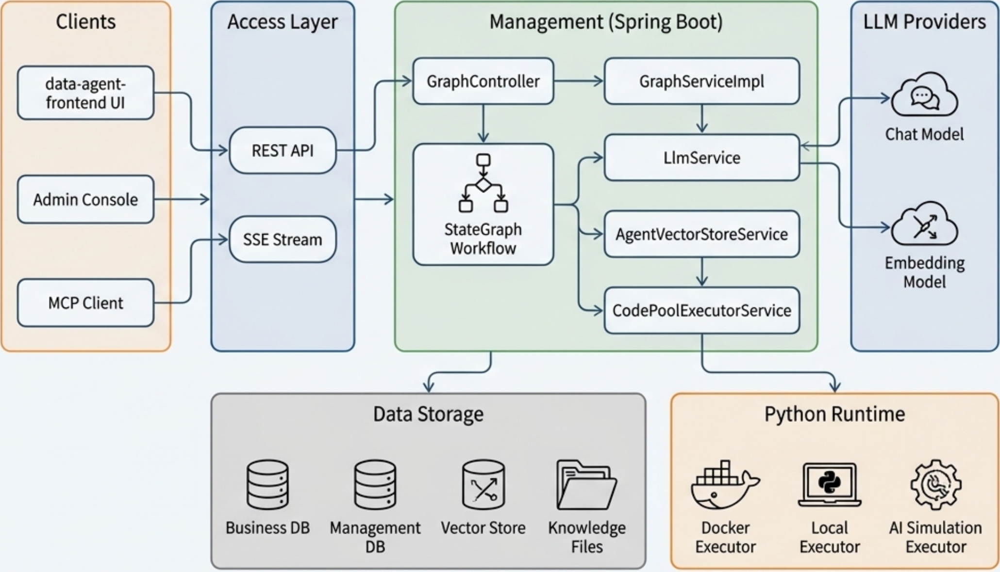

<div align="center">
  <h1>Audaque DataAgent</h1>
  <p>
    <strong>基于 Spring AI 的企业级智能数据分析师</strong>
  </p>
  <p>
     Text-to-SQL | Python 深度分析 | 智能报告 | MCP 服务器 | RAG 增强
  </p>

  <p>
    
    
    
  </p>

   <p>
    <a href="#-项目简介">项目简介</a> • 
    <a href="#-核心特性">核心特性</a> • 
    <a href="#-快速开始">快速开始</a> • 
    <a href="#-文档导航">文档导航</a> • 
  </p>
</div>

<br/>

<div align="center">
    
</div>

<br/>

## 📖 项目简介

**DataAgent** 是一个基于 **Spring AI Audaque Graph** 打造的企业级智能数据分析 Agent。它超越了传统的 Text-to-SQL 工具，进化为一个能够执行 **Python 深度分析**、生成 **多维度图表报告** 的 AI 智能数据分析师。

系统采用高度可扩展的架构设计，**全面兼容 OpenAI 接口规范**的对话模型与 Embedding 模型，并支持**灵活挂载任意向量数据库**。无论是私有化部署还是接入主流大模型服务（如 Qwen, Deepseek），都能轻松适配，为企业提供灵活、可控的数据洞察服务。

同时，本项目原生支持 **MCP (Model Context Protocol)**，可作为 MCP 服务器无缝集成到 Claude Desktop 等支持 MCP 的生态工具中。

## ✨ 核心特性

| 特性                | 说明                                                                                    |
| :------------------ | :-------------------------------------------------------------------------------------- |
| **智能数据分析**    | 基于 StateGraph 的 Text-to-SQL 转换，支持复杂的多表查询和多轮对话意图理解。             |
| **Python 深度分析** | 内置 Docker/Local Python 执行器，自动生成并执行 Python 代码进行统计分析与机器学习预测。 |
| **智能报告生成**    | 分析结果自动汇总为包含 ECharts 图表的 HTML/Markdown 报告，所见即所得。                  |
| **人工反馈机制**    | 独创的 Human-in-the-loop 机制，支持用户在计划生成阶段进行干预和调整。                   |
| **RAG 检索增强**    | 集成向量数据库，支持对业务元数据、术语库的语义检索，提升 SQL生成准确率。                |
| **多模型调度**      | 内置模型注册表，支持运行时动态切换不同的 LLM 和 Embedding 模型。                        |
| **MCP 服务器**      | 遵循 MCP 协议，支持作为 Tool Server 对外提供 NL2SQL 和 智能体管理能力。                 |
| **API Key 管理**    | 完善的 API Key 生命周期管理，支持细粒度的权限控制。                                     |

## 🏗️ 项目结构



## 🚀 快速开始

> 详细的安装和配置指南请参考 [📑 快速开始文档](docs/QUICK_START.md)。

### 1. 准备环境

- JDK 17+
- Maven 3.6.3+ (推荐 3.9.9，项目自带 Maven Wrapper)
- MySQL 5.7+
- Node.js 16+
- npm 9.x 或 10.x (推荐 10.x，npm 11.6 存在兼容性问题)

### 2. 编译构建

#### 后端编译

```bash
# Windows 系统
.\mvnw.cmd -B clean compile -DskipTests=true

# Linux/Mac 系统
./mvnw -B clean compile -DskipTests=true

# 或使用 Maven（如果已安装）
mvn -B clean compile -DskipTests=true
```

#### 前端编译

```bash
# 进入前端目录
cd data-agent-frontend

# 安装依赖
# Windows 系统 (PowerShell)
npm install
# Linux/Mac 系统
yarn install

# 编译构建
# Windows 系统 (PowerShell)
npm run build
# Linux/Mac 系统
yarn build
```

### 3. 启动服务

```bash
# 1. 导入数据库
mysql -u root -p < data-agent-management/src/main/resources/sql/schema.sql

# 2. 启动后端
cd data-agent-management
# Windows 系统
.\mvnw.cmd spring-boot:run
# Linux/Mac 系统
./mvnw spring-boot:run

# 3. 启动前端（开发模式）
cd data-agent-frontend
# Windows 系统 (PowerShell)
npm install; npm run dev
# Linux/Mac 系统
yarn install && yarn dev
```

### 4. 生产打包

#### 后端打包

```bash
# Windows 系统
.\mvnw.cmd -B clean package -DskipTests=true

# Linux/Mac 系统
./mvnw -B clean package -DskipTests=true

# 打包文件位置：data-agent-management/target/*.jar
```

#### 前端打包

```bash
cd data-agent-frontend

# 生产环境构建
# Windows 系统 (PowerShell)
npm run build
# Linux/Mac 系统
yarn build

# 构建产物位置：data-agent-frontend/dist/
```

### 5. 生产部署（使用 JAR 包）

#### 5.1 准备配置文件

```bash
# 1. 创建部署目录
mkdir -p /opt/dataagent
cd /opt/dataagent

# 2. 复制配置文件模板
cp /path/to/DataAgent/application.yml.sample ./application.yml

# 3. 编辑配置文件，修改数据库连接等信息
vi application.yml
```

**重要配置项说明**：

| 配置项                       | 说明           | 必须修改   |
| ---------------------------- | -------------- | ---------- |
| `spring.datasource.url`      | 数据库连接地址 | ✅ 是       |
| `spring.datasource.username` | 数据库用户名   | ✅ 是       |
| `spring.datasource.password` | 数据库密码     | ✅ 是       |
| `server.port`                | 后端服务端口   | ❌ 可选     |
| `logging.file.name`          | 日志文件路径   | ❌ 建议配置 |

> 完整配置说明请参考 [`application.yml.sample`](application.yml.sample) 文件中的注释

#### 5.2 复制 JAR 包

```bash
# 复制后端 JAR 包到部署目录
cp data-agent-management/target/spring-ai-audaque-data-agent-management-*.jar /opt/dataagent/dataagent-backend.jar
```

#### 5.3 启动后端服务

**方式1：使用外部配置文件启动（推荐）**

```bash
cd /opt/dataagent

# 配置外部Prompt目录（可选，用于无需重新编译即可修改Prompt）
export DATAAGENT_PROMPT_DIR=/opt/dataagent/prompts

# Spring Boot 会自动加载同级目录或 config/ 子目录的 application.yml
java -jar dataagent-backend.jar

# 或指定配置文件路径和Prompt目录
java -Ddataagent.prompt.dir=/opt/dataagent/prompts -jar dataagent-backend.jar --spring.config.location=./application.yml
```

> **外部Prompt配置说明**: 如需在运行时修改Prompt模板而无需重新编译JAR包，可配置外部Prompt目录。详见 [📝 外部Prompt配置指南](docs/EXTERNAL_PROMPTS_GUIDE.md)。

**方式2：使用环境变量（敏感信息推荐）**

```bash
# 设置环境变量
export DATA_AGENT_DATASOURCE_URL="jdbc:mysql://192.168.1.100:3306/data_agent"
export DATA_AGENT_DATASOURCE_USERNAME="prod_user"
export DATA_AGENT_DATASOURCE_PASSWORD="your_password"

# 启动服务
java -jar dataagent-backend.jar
```

**方式3：命令行参数覆盖**

```bash
java -jar dataagent-backend.jar \
  --spring.datasource.url="jdbc:mysql://192.168.1.100:3306/data_agent" \
  --spring.datasource.username="prod_user" \
  --spring.datasource.password="your_password"
```

#### 5.4 生产环境启动建议

**使用 JVM 参数优化**：

```bash
java -Xmx2g -Xms2g \
  -XX:+UseG1GC \
  -XX:+HeapDumpOnOutOfMemoryError \
  -XX:HeapDumpPath=/var/log/dataagent/heapdump.hprof \
  -Dfile.encoding=UTF-8 \
  -jar dataagent-backend.jar
```

**后台运行并记录日志**：

```bash
# 使用 nohup 后台运行（支持 IPv4 和 IPv6 双栈）
nohup java -Xmx2g -Xms2g \
  -XX:+UseG1GC \
  -Dfile.encoding=UTF-8 \
  -jar dataagent-backend.jar \
  > /var/log/dataagent/console.log 2>&1 &

# 查看进程
ps aux | grep dataagent-backend

# 验证监听地址（应该同时显示 IPv4 和 IPv6）
netstat -anlp | grep 8065
# 预期输出：
# tcp   0  0  0.0.0.0:8065  0.0.0.0:*  LISTEN  <PID>/java
# tcp6  0  0  :::8065       :::*       LISTEN  <PID>/java

# 查看日志
tail -f /var/log/dataagent/console.log
```

**网络配置说明**：
- 默认同时支持 IPv4 和 IPv6 访问
- IPv4 地址：`http://172.16.1.137:8065`
- IPv6 地址：`http://[::1]:8065` 或 `http://[fe80::1]:8065`
- 如果只需 IPv4，添加参数：`-Djava.net.preferIPv4Stack=true`
- 如果只需 IPv6，添加参数：`-Djava.net.preferIPv6Addresses=true`

**创建 systemd 服务（推荐）**：

```bash
# 创建服务文件
sudo vi /etc/systemd/system/dataagent.service
```

添加以下内容：

```ini
[Unit]
Description=Audaque DataAgent Service
After=network.target mysql.service

[Service]
Type=simple
User=dataagent
WorkingDirectory=/opt/dataagent
ExecStart=/usr/bin/java -Xmx2g -Xms2g -jar /opt/dataagent/dataagent-backend.jar
Restart=always
RestartSec=10
StandardOutput=append:/var/log/dataagent/console.log
StandardError=append:/var/log/dataagent/error.log

# 环境变量（可选）
Environment="DATA_AGENT_DATASOURCE_PASSWORD=your_password"

# 外部Prompt目录配置（可选，用于运行时修改Prompt）
Environment="DATAAGENT_PROMPT_DIR=/opt/dataagent/prompts"

# 如需强制使用 IPv4，可添加：
# Environment="JAVA_OPTS=-Djava.net.preferIPv4Stack=true"

[Install]
WantedBy=multi-user.target
```

# 启动服务

```bash
# 重载 systemd 配置
sudo systemctl daemon-reload

# 启动服务
sudo systemctl start dataagent

# 设置开机自启
sudo systemctl enable dataagent

# 查看服务状态
sudo systemctl status dataagent

# 查看日志
journalctl -u dataagent -f
```

#### 5.5 防火墙配置

**方案 1：开放必要端口（推荐）**：

```bash
# CentOS/RHEL/KylinV10 使用 firewalld
sudo firewall-cmd --permanent --add-port=80/tcp     # 前端端口
sudo firewall-cmd --permanent --add-port=8065/tcp   # 后端端口
sudo firewall-cmd --reload

# 验证规则
sudo firewall-cmd --list-all

# Ubuntu/Debian 使用 ufw
sudo ufw allow 80/tcp
sudo ufw allow 8065/tcp
sudo ufw status
```

**方案 2：禁用防火墙（仅测试环境）**：

```bash
# CentOS/RHEL/KylinV10
sudo systemctl stop firewalld
sudo systemctl disable firewalld

# Ubuntu/Debian
sudo ufw disable
```

⚠️ **警告**：生产环境不建议完全禁用防火墙，请使用方案 1 开放特定端口。

#### 5.6 部署前端（静态文件）

**使用 Nginx 部署前端**：

```bash
# 1. 安装 Nginx
sudo apt-get install nginx  # Ubuntu/Debian
sudo yum install nginx      # CentOS/RHEL

# 2. 复制前端构建产物
sudo cp -r data-agent-frontend/dist/* /var/www/dataagent/

# 3. 配置 Nginx
sudo vi /etc/nginx/sites-available/dataagent
```

Nginx 配置示例：

```nginx
server {
    listen 80;
    server_name your-domain.com;  # 修改为实际域名或 IP

    # 前端静态文件
    location / {
        root /var/www/dataagent;
        index index.html;
        try_files $uri $uri/ /index.html;
    }

    # 后端 API 代理
    location /api/ {
        proxy_pass http://localhost:8065/;
        proxy_set_header Host $host;
        proxy_set_header X-Real-IP $remote_addr;
        proxy_set_header X-Forwarded-For $proxy_add_x_forwarded_for;
        proxy_set_header X-Forwarded-Proto $scheme;
    }

    # 文件上传配置
    client_max_body_size 10M;
}
```

启用配置并重启 Nginx：

```bash
# 启用站点配置
sudo ln -s /etc/nginx/sites-available/dataagent /etc/nginx/sites-enabled/

# 测试配置
sudo nginx -t

# 重启 Nginx
sudo systemctl restart nginx
```

### 6. 访问系统

- **开发环境**：`http://localhost:3000`
- **生产环境**：`http://your-domain.com` 或 `http://your-server-ip`

开始创建您的第一个数据智能体！

## 📚 文档导航

| 文档                                                   | 此文档包含的内容                                                   |
| :----------------------------------------------------- | :----------------------------------------------------------------- |
| [快速开始](docs/QUICK_START.md)                        | 环境要求、数据库导入、基础配置、系统初体验                         |
| [架构设计](docs/ARCHITECTURE.md)                       | 系统分层架构、StateGraph与工作流设计、核心模块时序图               |
| [开发者指南](docs/DEVELOPER_GUIDE.md)                  | 开发环境搭建、详细配置手册、代码规范、扩展开发(向量库/模型)        |
| [高级功能](docs/ADVANCED_FEATURES.md)                  | API Key 调用、MCP 服务器配置、自定义混合检索策略、Python执行器配置 |
| [知识配置最佳实践](docs/KNOWLEDGE_USAGE.md)            | 语义模型，业务知识，智能体知识的解释和使用                         |
| [外部Prompt配置指南](docs/EXTERNAL_PROMPTS_GUIDE.md)   | 外部Prompt目录配置、热更新、版本控制，无需重编译修改Prompt模板     |
| [编译与安装指南](docs/DEPLOY_GUIDE.md)                 | 编译脚本使用、安装脚本部署、离线部署流程                           |
| [更新指南](docs/UPDATE_GUIDE.md)                       | 已部署环境下更新前后端的详细步骤，保留现有配置                     |
| [达梦数据库部署手册](docs/DEPLOY_BY_DAMENG.md)      | 基于达梦数据库(DM8)的完整部署流程                                  |
| [Widget嵌入指南](docs/WIDGET_GUIDE.md)                 | 网页嵌入Widget使用、API Key生成、自定义主题配置                    |
| [Embedding维度修改指南](docs/EMBEDDING_DIMENSION_GUIDE.md) | Embedding模型维度配置、Milvus Collection重建                   |
| [Milvus启动配置指南](docs/MILVUS_STARTUP_GUIDE.md)     | Milvus服务手动启动、systemd开机自启动配置                          |
| [Milvus使用指南](docs/MILVUS_USAGE_GUIDE.md)           | Milvus集合管理、数据查询、常用操作                                 |

## 📄 许可证

本项目采用 Apache License 2.0 许可证。

---

<div align="center">
    Made with ❤️ by Spring AI Audaque DataAgent Team
</div>
