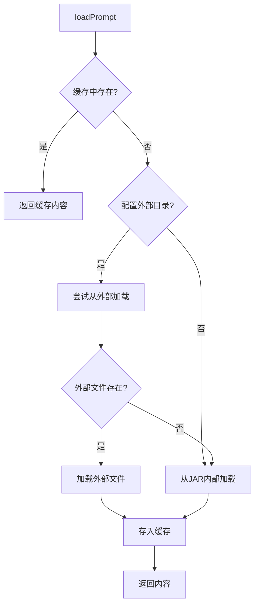

# 外部Prompt配置指南

本文档介绍如何配置和使用外部Prompt目录,实现在不重新编译JAR包的情况下修改Prompt模板。

## 功能概述

DataAgent支持从外部目录加载Prompt模板文件,提供以下优势:

- **无需重新编译**: 修改Prompt后无需重新编译和部署JAR包
- **灵活配置**: 可以在运行时动态调整Prompt内容
- **版本控制**: 可以独立管理Prompt模板的版本
- **快速迭代**: 支持热更新,修改后立即生效

## 配置方式

### 方式1: application.yml配置（推荐）

在`application.yml`中配置外部Prompt目录：

```yaml
spring:
  ai:
    alibaba:
      data-agent:
        prompt:
          # 支持绝对路径
          external-dir: /opt/dataagent/prompts
          # 或相对路径（相对于应用启动目录）
          # external-dir: ./prompts
```

**Windows环境示例：**
```yaml
spring:
  ai:
    alibaba:
      data-agent:
        prompt:
          external-dir: C:/dataagent/prompts
          # 或使用双反斜杠
          # external-dir: C:\\dataagent\\prompts
```

> **优势**：配置集中管理，方便统一维护和版本控制

### 方式2: 环境变量

设置环境变量 `DATAAGENT_PROMPT_DIR` 指向外部Prompt目录:

**Linux/macOS:**
```bash
export DATAAGENT_PROMPT_DIR=/opt/dataagent/prompts
```

**Windows:**
```powershell
$env:DATAAGENT_PROMPT_DIR="C:\dataagent\prompts"
```

或者在系统环境变量中永久设置。

### 方式2: JVM系统属性

在启动JAR时通过 `-D` 参数指定：

```bash
java -Ddataagent.prompt.dir=/opt/dataagent/prompts -jar data-agent-management.jar
```

### 优先级

如果同时配置了多个方式，优先级如下：

1. **application.yml 配置** `spring.ai.alibaba.data-agent.prompt.external-dir` (最高优先级)
2. **环境变量** `DATAAGENT_PROMPT_DIR`
3. **JVM系统属性** `dataagent.prompt.dir`
4. **JAR内部资源** (默认回退)

## 准备外部Prompt目录

### 1. 创建目录结构

```bash
mkdir -p /opt/dataagent/prompts
```

### 2. 复制现有Prompt模板

从JAR包中导出当前使用的Prompt模板作为初始版本:

```bash
# 方式1: 从源码复制
cp data-agent-management/src/main/resources/prompts/*.txt /opt/dataagent/prompts/

# 方式2: 从JAR包解压
jar xf data-agent-management.jar BOOT-INF/classes/prompts/
mv BOOT-INF/classes/prompts/*.txt /opt/dataagent/prompts/
```

### 3. 验证文件列表

外部Prompt目录应包含以下文件:

```
/opt/dataagent/prompts/
├── intent-recognition.txt         # 意图识别
├── query-enhancement.txt          # 查询增强
├── feasibility-assessment.txt     # 可行性评估
├── mix-selector.txt               # 表选择
├── evidence-query-rewrite.txt     # 证据查询重写
├── agent-knowledge.txt            # Agent知识
├── business-knowledge.txt         # 业务知识
├── sql-generator.txt              # SQL生成
├── sql-error-fixer.txt            # SQL错误修复
├── semantic-consistency.txt       # 语义一致性
├── json-fix.txt                   # JSON修复
├── planner.txt                    # 执行计划生成
└── report-generator.txt           # 报告生成
```

## 修改Prompt模板

### 1. 编辑Prompt文件

直接修改外部目录中的`.txt`文件:

```bash
vim /opt/dataagent/prompts/intent-recognition.txt
```

**注意事项:**

- **保持UTF-8编码**: 所有Prompt文件必须使用UTF-8编码
- **避免StringTemplate冲突**: 不要在Prompt中直接使用裸露的JSON示例(如`{"key": "value"}`),改用文字描述
- **保留占位符**: 保留`{variable_name}`格式的占位符,这些会被动态替换

### 2. 热更新Prompt缓存

修改Prompt后,通过以下方式使其生效:

#### 方式1: API重新加载(推荐)

**重新加载单个Prompt:**
```bash
curl -X POST http://localhost:8080/api/prompt-config/reload/intent-recognition
```

**重新加载所有Prompt:**
```bash
curl -X POST http://localhost:8080/api/prompt-config/reload-all
```

#### 方式2: 重启服务

```bash
systemctl restart dataagent
```

## API接口说明

### 1. 获取外部Prompt目录配置

**接口:** `GET /api/prompt-config/external-dir`

**响应示例:**
```json
{
  "success": true,
  "externalDir": "/opt/dataagent/prompts",
  "configured": true,
  "cacheSize": 13,
  "message": "外部Prompt目录已配置: /opt/dataagent/prompts"
}
```

### 2. 重新加载所有Prompt

**接口:** `POST /api/prompt-config/reload-all`

**响应示例:**
```json
{
  "success": true,
  "message": "已清空所有Prompt缓存,下次调用时将重新加载",
  "clearedCount": 13
}
```

### 3. 重新加载指定Prompt

**接口:** `POST /api/prompt-config/reload/{promptName}`

**参数:**
- `promptName`: Prompt文件名(不含.txt后缀)

**示例:**
```bash
curl -X POST http://localhost:8080/api/prompt-config/reload/intent-recognition
```

**响应示例:**
```json
{
  "success": true,
  "message": "已清空Prompt缓存: intent-recognition,下次调用时将重新加载",
  "promptName": "intent-recognition"
}
```

## 加载优先级说明

PromptLoader的加载逻辑:

1. **检查外部目录**: 如果配置了外部目录,优先从外部加载
2. **回退到JAR内部**: 如果外部文件不存在或读取失败,自动回退到JAR内部资源
3. **缓存机制**: 加载的Prompt会被缓存,避免重复读取文件

**加载流程:**



## 最佳实践

### 1. 版本控制

建议使用Git管理外部Prompt目录:

```bash
cd /opt/dataagent/prompts
git init
git add *.txt
git commit -m "Initial prompt templates"
```

### 1. 部署流程

在生产环境部署时：

```bash
# 1. 准备Prompt目录
mkdir -p /opt/dataagent/prompts
cp prompts/*.txt /opt/dataagent/prompts/

# 2. 配置 application.yml
cat >> /opt/dataagent/application.yml << 'EOF'
spring:
  ai:
    alibaba:
      data-agent:
        prompt:
          external-dir: /opt/dataagent/prompts
EOF

# 3. 启动服务
java -jar data-agent-management.jar

# 4. 验证配置
curl http://localhost:8080/api/prompt-config/external-dir
```

### 3. 热更新工作流

修改Prompt的推荐流程：

```bash
# 1. 编辑Prompt文件
vim /opt/dataagent/prompts/intent-recognition.txt

# 2. 备份原始版本(可选)
cp intent-recognition.txt intent-recognition.txt.bak

# 3. 测试修改后的Prompt
# (在开发环境进行测试)

# 4. 热更新缓存
curl -X POST http://localhost:8080/api/prompt-config/reload/intent-recognition

# 5. 验证效果
# (发起实际请求测试新Prompt)

# 6. 如有问题,快速回滚
mv intent-recognition.txt.bak intent-recognition.txt
curl -X POST http://localhost:8080/api/prompt-config/reload/intent-recognition
```

### 4. 监控和日志

查看Prompt加载日志:

```bash
# 查看启动时的配置日志
grep "external prompt directory" application.log

# 查看Prompt加载日志
grep "Successfully loaded prompt" application.log

# 查看缓存清空日志
grep "Prompt cache cleared" application.log
```

## 故障排查

### 问题1: 外部Prompt未生效

**检查步骤:**

1. 首先检查application.yml配置：
```yaml
spring:
  ai:
    alibaba:
      data-agent:
        prompt:
          external-dir: /opt/dataagent/prompts  # 确认路径正确
```

2. 如果使用环境变量，确认设置：
```bash
echo $DATAAGENT_PROMPT_DIR
```

3. 确认文件路径和名称：
```bash
ls -l $DATAAGENT_PROMPT_DIR/*.txt
```

3. 检查文件编码:
```bash
file $DATAAGENT_PROMPT_DIR/intent-recognition.txt
# 应显示: UTF-8 Unicode text
```

4. 检查应用日志中的加载信息

### 问题2: Prompt缓存未更新

**解决方案:**

1. 手动清空缓存:
```bash
curl -X POST http://localhost:8080/api/prompt-config/reload-all
```

2. 重启服务:
```bash
systemctl restart dataagent
```

### 问题3: StringTemplate解析错误

**错误示例:**
```
ERROR: '"value"' came as a complete surprise to me
```

**解决方案:**

避免在Prompt中使用裸露的JSON示例,改用文字描述:

**❌ 错误写法:**
```
输出格式: {"classification": "分类名称"}
```

**✅ 正确写法:**
```
输出格式: 包含classification字段的JSON对象
示例格式见上方Answer部分
```

## 与数据库Prompt配置的关系

DataAgent提供两种Prompt管理方式:

| 特性       | 外部Prompt目录 | 数据库Prompt配置     |
| ---------- | -------------- | -------------------- |
| 用途       | 核心Prompt模板 | 用户自定义优化配置   |
| 存储位置   | 文件系统       | MySQL/DM数据库       |
| 生效范围   | 全局           | 可按Agent区分        |
| 热更新方式 | API重新加载    | 数据库更新后立即生效 |
| 适用场景   | 修改核心逻辑   | 添加优化提示词       |

**推荐使用场景:**

- **外部Prompt目录**: 修改核心Prompt模板(如意图识别、SQL生成逻辑)
- **数据库Prompt配置**: 为特定Agent添加额外的优化提示词(如报告生成风格、SQL优化建议)

两者可以结合使用,数据库配置会被附加到核心Prompt之后。

## 示例配置文件

### systemd服务配置示例

`/etc/systemd/system/dataagent.service`:

```ini
[Unit]
Description=DataAgent Service
After=network.target

[Service]
Type=simple
User=dataagent
WorkingDirectory=/opt/dataagent
Environment="DATAAGENT_PROMPT_DIR=/opt/dataagent/prompts"
ExecStart=/usr/bin/java -jar /opt/dataagent/data-agent-management.jar
Restart=on-failure
RestartSec=10

[Install]
WantedBy=multi-user.target
```

### Docker Compose配置示例

`docker-compose.yml`:

```yaml
version: '3.8'
services:
  dataagent:
    image: dataagent:latest
    environment:
      - DATAAGENT_PROMPT_DIR=/app/prompts
    volumes:
      - ./prompts:/app/prompts:ro
    ports:
      - "8080:8080"
```

## 总结

通过配置外部Prompt目录,您可以:

1. ✅ 无需重新编译JAR包即可修改Prompt模板
2. ✅ 通过API实现热更新,修改立即生效
3. ✅ 独立管理Prompt模板的版本控制
4. ✅ 在外部文件不存在时自动回退到JAR内部资源

这大大提高了Prompt调优的灵活性和效率!
