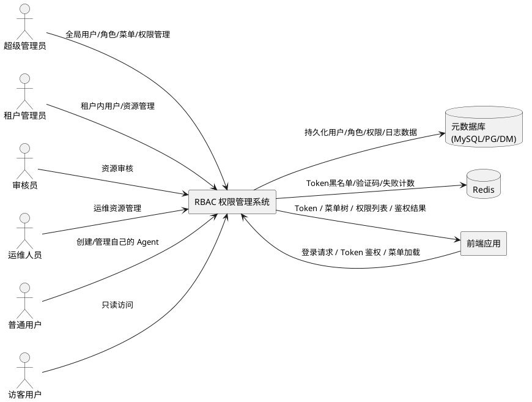
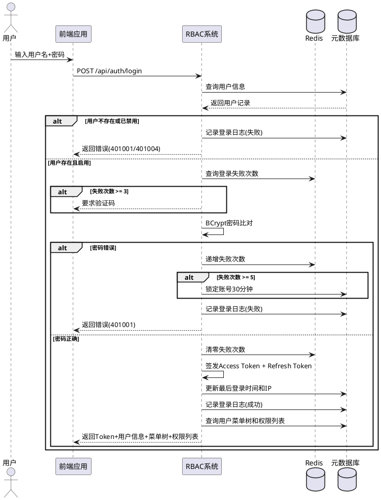
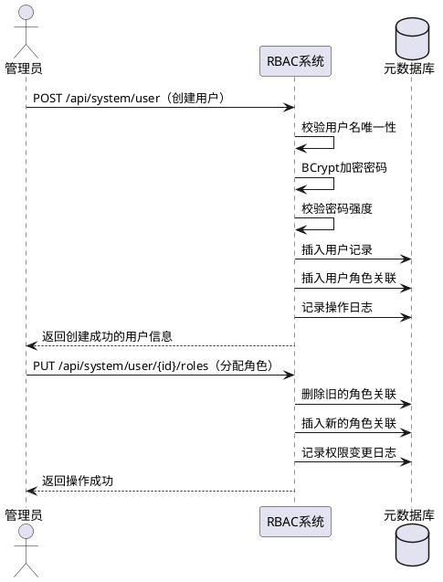
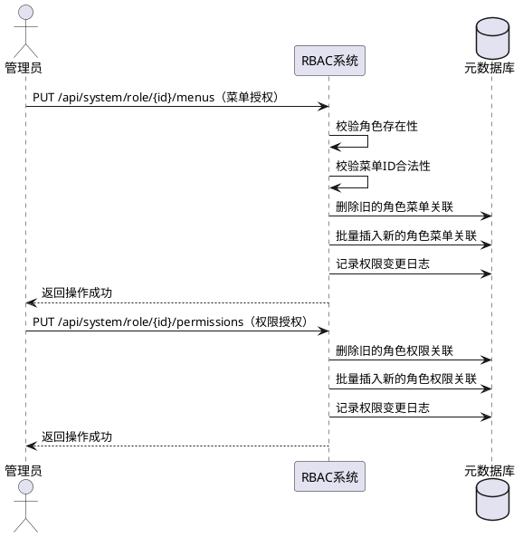
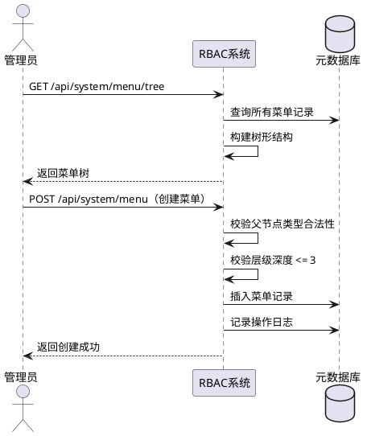
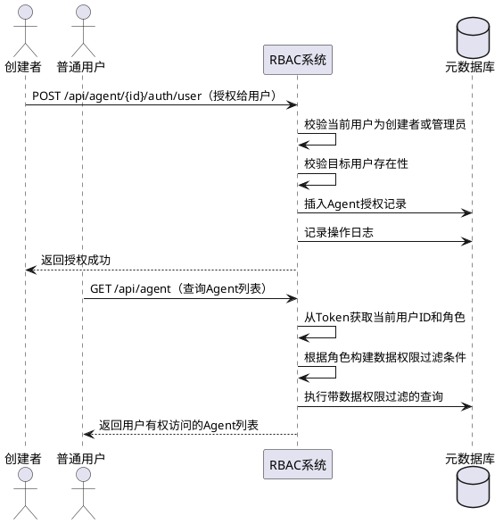
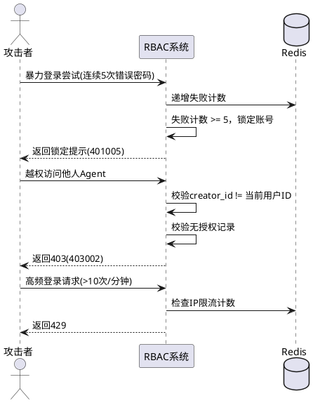
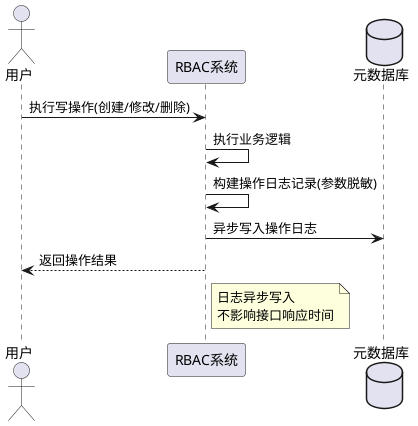
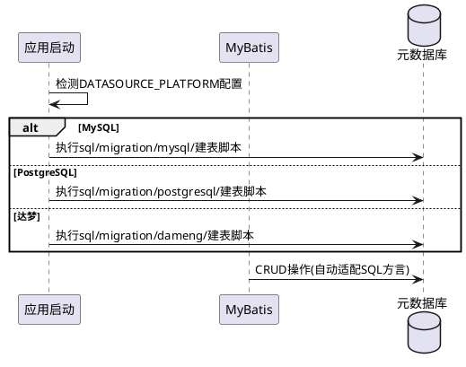
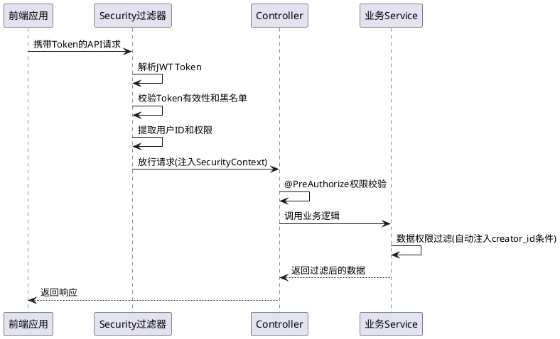

# **1. 组件定位**

## **1.1 核心职责**

本组件负责管理用户认证与访问控制，实现基于角色的权限隔离与资源授权。

## **1.2 核心输入**

1. 用户登录请求：用户名、密码、验证码（可选），来自前端登录页面
2. Token 刷新请求：Refresh Token，来自前端自动刷新机制
3. 用户管理操作请求：用户 CRUD、角色分配、密码重置，来自管理员操作
4. 角色管理操作请求：角色 CRUD、菜单授权、权限授权，来自管理员操作
5. 菜单管理操作请求：菜单 CRUD，来自管理员操作
6. Agent 授权操作请求：Agent 资源授权/收回，来自 Agent 创建者或管理员
7. 所有 `/api/*` 接口请求：携带 Access Token，来自前端/第三方调用
8. 个人信息修改请求：昵称、邮箱、手机号、密码修改，来自登录用户自身

## **1.3 核心输出**

1. 登录认证响应：Access Token、Refresh Token、用户信息、菜单树、权限列表
2. Token 刷新响应：新的 Access Token
3. 用户/角色/菜单管理响应：CRUD 操作结果
4. 接口鉴权结果：放行合法请求或返回 401/403 错误
5. 动态菜单树：根据用户角色返回可访问的菜单与按钮权限
6. Agent 数据权限过滤结果：仅返回用户有权访问的 Agent 资源
7. 审计日志记录：登录日志、操作日志、权限变更日志

## **1.4 职责边界**

- 不负责前端页面的渲染与交互逻辑（前端仅消费菜单树和权限列表）
- 不负责 OAuth2/SSO 外部认证源的实现（P3 优先级，本期不实现）
- 不负责密码找回的邮件发送服务（P2 优先级，本期不实现）
- 不负责租户管理的完整业务逻辑（仅利用 tenant_id 做数据隔离）
- 不负责 Agent 本身的业务逻辑（仅负责 Agent 资源的权限校验与数据过滤）

# **2. 领域术语**

**RBAC**
: 基于角色的访问控制模型，用户通过绑定角色获得权限，权限决定可访问的菜单与可执行的操作。

**Access Token**
: 短有效期认证令牌（2小时），用于接口鉴权，包含用户身份、角色与权限信息。

**Refresh Token**
: 长有效期刷新令牌（7天），仅用于获取新的 Access Token，不直接用于接口鉴权。

**菜单（Menu）**
: 系统功能入口，支持目录（type=0）、菜单页面（type=1）、按钮权限（type=2）三级树形结构。

**权限标识（Permission）**
: 后端接口级别的操作权限编码，格式为 `{模块}:{操作}`，如 `agent:create`、`user:edit`。

**数据权限**
: 控制用户可访问的数据范围，基于资源创建者归属与显式授权关系实现行级数据过滤。

**预置角色（System Role）**
: 系统初始化时创建的六种基础角色（SUPER_ADMIN、TENANT_ADMIN、AUDITOR、OPS_ADMIN、NORMAL_USER、GUEST），不可删除。

**逻辑删除**
: 通过 `deleted` 标记位实现软删除（0=正常，1=已删除），数据物理保留但不可见。

**Token 黑名单**
: 用户主动退出后，其 Token 加入 Redis 黑名单使其立即失效，过期后自动清除。

**账号锁定**
: 连续登录失败达到阈值后，账号被临时禁止登录，锁定期间拒绝所有登录尝试。

# **3. 角色与边界**

## **3.1 核心角色**

- **超级管理员（SUPER_ADMIN）**：拥有系统所有权限，可管理全局用户、角色、菜单与所有资源
- **租户管理员（TENANT_ADMIN）**：管理租户内用户与资源，不可跨租户操作
- **审核员（AUDITOR）**：审核 Agent、知识库等资源，拥有只读与审核权限
- **运维人员（OPS_ADMIN）**：管理数据源、模型配置等运维资源，对 Agent/知识库只读
- **普通用户（NORMAL_USER）**：创建和管理自己的 Agent，可使用被授权的他人 Agent
- **访客用户（GUEST）**：只读访问被授权的 Agent，不可创建任何资源

## **3.2 外部系统**

- **Redis**：存储 Token 黑名单、验证码缓存、登录失败计数
- **元数据库（MySQL/PostgreSQL/达梦）**：存储用户、角色、菜单、权限、授权关系及日志数据
- **前端应用**：消费菜单树与权限列表，通过 Token 发起接口请求

## **3.3 交互上下文**

# **4. DFX约束**

## **4.1 性能**

- 登录认证接口响应时间不超过 500ms（不含网络延迟）
- Token 鉴权过滤器执行时间不超过 10ms
- 动态菜单树加载时间不超过 200ms
- 用户/角色/菜单 CRUD 接口响应时间不超过 300ms
- Agent 数据权限过滤增加的查询耗时不超过原查询的 20%

## **4.2 可靠性**

- Token 黑名单 Redis 不可用时，降级为仅依赖 Token 过期时间校验，并在日志中告警
- 验证码 Redis 不可用时，降级为不要求验证码（登录失败限制仍生效）
- 系统可用性目标：99.9%

## **4.3 安全性**

- JWT 签名算法必须使用 HMAC-SHA256 或 RSA256，密钥长度 >= 256 位
- 密码必须使用 BCrypt（cost factor >= 10）加密存储，严禁明文存储
- 所有 `/api/*` 接口（除白名单外）必须校验 Token 有效性
- CORS 策略必须限制允许的来源域名，禁止使用通配符 `*`
- 登录接口必须强制 HTTPS
- 数据权限过滤必须使用参数化查询，禁止字符串拼接 SQL 条件

## **4.4 可维护性**

- 所有写操作必须记录操作日志（操作人、操作类型、目标资源、请求参数脱敏、响应结果、IP）
- 所有登录尝试必须记录登录日志（用户名、IP、时间、设备、结果）
- 权限变更必须记录变更前后值
- 敏感操作（密码重置、用户删除、角色删除）必须单独标记记录

## **4.5 兼容性**

- 新增的 RBAC 相关表和字段不得破坏现有业务表结构
- 现有 Controller 接口路径不变，仅新增权限注解校验
- 现有 `Agent.adminId` 字段重命名为 `creatorId`，需提供数据迁移脚本
- 三种元数据库（MySQL、PostgreSQL、达梦）的建表 SQL 必须分别提供
- 迁移脚本必须支持增量执行，不可重复建表

# **5. 核心能力**

## **5.1 登录认证**

### **5.1.1 业务规则**

1. **用户名密码登录**：用户通过用户名和密码进行身份认证，认证成功后签发 Access Token 和 Refresh Token

   a. 验收条件：[用户提交正确的用户名和密码] → [系统返回 Access Token、Refresh Token、用户信息、菜单树和权限列表]

2. **Token 签发**：登录成功后签发的 Token 必须包含用户 ID、用户名、角色列表、权限列表，并设置签发时间和过期时间

   a. 验收条件：[用户登录成功] → [系统签发 Access Token（有效期2小时）和 Refresh Token（有效期7天），Token Payload 包含 sub、username、roles、permissions、iat、exp]

3. **接口鉴权**：所有 `/api/*` 接口（除白名单外）必须校验 Access Token 的有效性

   a. 验收条件：[请求携带有效 Token 访问受保护接口] → [系统放行请求]
   b. 验收条件：[请求不携带 Token 访问受保护接口] → [系统返回 401 状态码和错误码 401003]
   c. 验收条件：[请求携带过期 Token 访问受保护接口] → [系统返回 401 状态码和错误码 401002]
   d. 验收条件：[请求携带被黑名单标记的 Token 访问受保护接口] → [系统返回 401 状态码和错误码 401003]

4. **Token 过期机制**：Access Token 有效期为 2 小时，Refresh Token 有效期为 7 天

   a. 验收条件：[Access Token 签发超过 2 小时] → [该 Token 失效，不可用于接口鉴权]
   b. 验收条件：[Refresh Token 签发超过 7 天] → [该 Token 失效，不可用于刷新]

5. **Token 刷新**：Access Token 过期后，可通过 Refresh Token 获取新的 Access Token，无需重新登录

   a. 验收条件：[使用有效的 Refresh Token 调用刷新接口] → [系统返回新的 Access Token]
   b. 验收条件：[使用过期或无效的 Refresh Token 调用刷新接口] → [系统返回 401 状态码]

6. **用户退出**：用户调用退出接口后，当前 Token 立即失效

   a. 验收条件：[用户调用退出接口] → [系统将当前 Token 加入 Redis 黑名单，该 Token 后续所有请求返回 401]

7. **登录失败限制**：连续 5 次密码错误后锁定账号 30 分钟

   a. 验收条件：[用户连续第 5 次输入错误密码] → [系统锁定该账号 30 分钟，返回错误码 401005]
   b. 验收条件：[用户在锁定期间尝试登录] → [系统拒绝登录，提示账号已锁定及剩余锁定时间]
   c. 验收条件：[账号锁定超过 30 分钟后用户尝试登录] → [系统允许登录尝试，失败计数清零]

8. **验证码机制**：同一用户登录失败 3 次后，后续登录需输入图形验证码

   a. 验收条件：[用户连续登录失败达到 3 次] → [后续登录请求必须携带验证码，无验证码则拒绝]
   b. 验收条件：[用户输入正确的验证码] → [系统继续校验用户名密码]
   c. 验收条件：[用户输入错误的验证码] → [系统直接返回验证码错误，不校验密码]

9. **用户状态校验**：禁用状态的用户禁止登录

   a. 验收条件：[禁用状态用户尝试登录] → [系统返回 401 状态码和错误码 401004，提示账号已被禁用]

10. **登录日志记录**：每次登录尝试（无论成功或失败）必须记录日志

    a. 验收条件：[用户发起登录请求] → [系统在登录日志表中记录用户名、IP、时间、设备信息、结果（成功/失败/锁定）]

11. **动态菜单加载**：登录成功后根据用户角色返回对应的菜单树与权限列表

    a. 验收条件：[用户登录成功] → [系统返回该用户角色对应的菜单树（仅含被授权的目录/菜单/按钮）和权限标识列表]
    b. 验收条件：[不同角色用户登录] → [返回不同的菜单树和权限列表]

12. **接口白名单**：以下接口不需要 Token 鉴权：`/api/auth/login`、`/api/auth/refresh`、`/api/auth/captcha`、`/api/auth/reset-password`、`/api/auth/oauth2/**`、`/nl2sql/stream`、`/actuator/health`

    a. 验收条件：[请求访问白名单接口且不携带 Token] → [系统正常处理请求，不返回 401]

### **5.1.2 交互流程**

### **5.1.3 异常场景**

1. **用户名不存在**

   a. 触发条件：登录请求中的用户名在系统中不存在
   b. 系统行为：记录登录失败日志，不区分"用户不存在"与"密码错误"
   c. 用户感知：错误码 401001，提示"用户名或密码错误"

2. **账号被锁定**

   a. 触发条件：用户连续登录失败达到 5 次，账号处于锁定期内
   b. 系统行为：拒绝登录，计算剩余锁定时间
   c. 用户感知：错误码 401005，提示"账号已被锁定，请X分钟后重试"

3. **Token 被篡改**

   a. 触发条件：请求携带的 Token 签名验证失败
   b. 系统行为：拒绝请求，记录安全日志
   c. 用户感知：错误码 401003，提示"Token无效"

4. **Refresh Token 过期**

   a. 触发条件：使用已过期的 Refresh Token 请求刷新
   b. 系统行为：拒绝刷新
   c. 用户感知：错误码 401002，提示"Token已过期，请重新登录"

5. **Redis 不可用**

   a. 触发条件：Token 黑名单查询时 Redis 连接失败
   b. 系统行为：降级为仅依赖 Token 过期时间校验，跳过黑名单检查，记录告警日志
   c. 用户感知：正常使用（用户退出后 Token 在过期前仍可使用，直到过期）

6. **并发登录**

   a. 触发条件：同一用户在多个设备同时登录
   b. 系统行为：每次登录签发独立 Token，不互斥
   c. 用户感知：多设备均可正常使用

## **5.2 用户管理**

### **5.2.1 业务规则**

1. **用户创建**：管理员可创建新用户，设置用户名、密码、角色

   a. 验收条件：[管理员提交合法的用户创建请求] → [系统创建用户记录，密码以 BCrypt 加密存储，返回创建成功的用户信息]
   b. 验收条件：[提交的用户名已存在] → [系统返回 409 错误码，提示用户名已存在]

2. **用户编辑**：管理员可编辑用户基本信息（昵称、邮箱、手机号、状态）

   a. 验收条件：[管理员提交用户编辑请求] → [系统更新用户信息，返回更新后的用户信息]

3. **用户删除**：用户删除为逻辑删除，标记 `deleted=1`

   a. 验收条件：[管理员删除用户] → [系统将该用户 `deleted` 标记为 1，该用户不可登录且不出现在用户列表中]
   b. 验收条件：[删除已绑定角色的用户] → [系统同时清除该用户的角色关联关系]

4. **用户查询**：支持分页查询，可按用户名、状态、角色筛选

   a. 验收条件：[管理员提交分页查询请求] → [系统返回符合条件的用户列表（含分页信息），密码字段不返回]

5. **用户详情**：查看单个用户详细信息，包含其角色列表

   a. 验收条件：[管理员查看用户详情] → [系统返回用户完整信息及绑定的角色列表]

6. **用户启用/禁用**：管理员可切换用户状态

   a. 验收条件：[管理员禁用用户] → [系统将该用户状态设为禁用，该用户立即无法登录]
   b. 验收条件：[管理员启用用户] → [系统将该用户状态设为启用，该用户可正常登录]

7. **用户角色分配**：为用户分配一个或多个角色，权限取并集

   a. 验收条件：[管理员为用户分配多个角色] → [系统更新用户角色关联，用户获得所有角色权限的并集]

8. **管理员重置密码**：管理员可重置指定用户的密码，无需旧密码

   a. 验收条件：[管理员重置用户密码] → [系统以 BCrypt 加密存储新密码，设置首次登录修改密码标记]
   b. 验收条件：[被重置密码的用户首次登录] → [系统强制要求修改密码后才可正常使用]

9. **修改个人信息**：用户可修改自己的昵称、邮箱、手机号

   a. 验收条件：[用户修改自己的个人信息] → [系统更新该用户信息]
   b. 验收条件：[用户尝试修改他人信息] → [系统返回 403 错误码]

10. **修改个人密码**：用户修改自己密码时必须校验旧密码

    a. 验收条件：[用户提交正确的旧密码和新密码] → [系统验证密码历史不重复，以 BCrypt 加密存储新密码]
    b. 验收条件：[用户提交错误的旧密码] → [系统返回错误，提示旧密码不正确]
    c. 验收条件：[新密码与最近5次使用过的密码重复] → [系统返回错误，提示密码不可重复使用]

11. **密码强度要求**：密码必须至少 8 位，包含大写字母、小写字母、数字和特殊字符

    a. 验收条件：[提交不符合强度要求的密码] → [系统返回参数校验错误，提示密码强度要求]

12. **权限分层**：租户管理员仅可管理租户内的用户，超级管理员可管理全局用户

    a. 验收条件：[租户管理员操作租户外用户] → [系统返回 403 错误码]

### **5.2.2 交互流程**

### **5.2.3 异常场景**

1. **用户名重复**

   a. 触发条件：创建用户时提交的用户名已存在（含逻辑删除的用户）
   b. 系统行为：拒绝创建，返回冲突错误
   c. 用户感知：错误码 409，提示"用户名已存在"

2. **密码强度不足**

   a. 触发条件：创建用户或修改密码时密码不满足强度要求
   b. 系统行为：拒绝操作
   c. 用户感知：错误码 400，提示密码强度要求规则

3. **密码历史重复**

   a. 触发条件：修改密码时新密码与最近5次密码重复
   b. 系统行为：拒绝修改
   c. 用户感知：错误码 400，提示"密码不可与最近5次使用过的密码重复"

4. **跨租户操作**

   a. 触发条件：租户管理员尝试操作其他租户的用户
   b. 系统行为：拒绝操作，记录越权日志
   c. 用户感知：错误码 403002，提示"无权操作他人的资源"

## **5.3 角色管理**

### **5.3.1 业务规则**

1. **角色创建**：创建新角色，设置角色编码、名称、描述

   a. 验收条件：[管理员提交合法的角色创建请求] → [系统创建角色记录，返回创建成功的角色信息]
   b. 验收条件：[提交的角色编码已存在] → [系统返回 409 错误码，提示角色编码已存在]

2. **角色编辑**：编辑角色基本信息（名称、描述、排序）

   a. 验收条件：[管理员编辑角色] → [系统更新角色信息]

3. **角色删除**：逻辑删除角色，预置角色不可删除

   a. 验收条件：[管理员删除非预置角色且该角色无用户绑定] → [系统逻辑删除该角色，清除角色菜单和角色权限关联]
   b. 验收条件：[管理员尝试删除预置角色] → [系统返回错误，提示预置角色不可删除]
   c. 验收条件：[管理员删除仍有用户绑定的角色] → [系统提示确认，确认后解除绑定并删除]

4. **角色查询**：分页查询角色列表

   a. 验收条件：[管理员提交角色查询请求] → [系统返回角色列表（含分页信息）]

5. **角色详情**：查看角色详情，包含权限列表、菜单列表、绑定用户数量

   a. 验收条件：[管理员查看角色详情] → [系统返回角色完整信息及关联的权限、菜单和用户数量]

6. **角色启用/禁用**：切换角色状态

   a. 验收条件：[管理员禁用角色] → [系统将该角色状态设为禁用，拥有该角色的用户立即失去对应权限]
   b. 验收条件：[管理员启用角色] → [系统将该角色状态设为启用，拥有该角色的用户恢复对应权限]

7. **角色菜单授权**：为角色分配可访问的菜单

   a. 验收条件：[管理员为角色分配菜单] → [系统更新角色菜单关联，记录权限变更日志]

8. **角色权限授权**：为角色分配操作权限（按钮/API 级别）

   a. 验收条件：[管理员为角色分配权限标识] → [系统更新角色权限关联，记录权限变更日志]

9. **预置角色约束**：六种系统预置角色（SUPER_ADMIN、TENANT_ADMIN、AUDITOR、OPS_ADMIN、NORMAL_USER、GUEST）不可删除，可修改名称和描述

   a. 验收条件：[尝试删除预置角色] → [系统拒绝操作]
   b. 验收条件：[修改预置角色的名称或描述] → [系统允许操作]

### **5.3.2 交互流程**

### **5.3.3 异常场景**

1. **删除有用户绑定的角色**

   a. 触发条件：删除角色时仍有用户绑定该角色
   b. 系统行为：提示用户确认，确认后解除绑定并删除
   c. 用户感知：提示"该角色下有N个用户，确认删除将解除绑定，是否继续？"

2. **禁用角色影响在线用户**

   a. 触发条件：禁用角色时拥有该角色的用户正在线上操作
   b. 系统行为：立即生效，该用户下次请求时权限校验失败
   c. 用户感知：在线用户的后续受限操作返回 403

## **5.4 菜单与权限管理**

### **5.4.1 业务规则**

1. **菜单创建**：创建目录（type=0）、菜单页面（type=1）或按钮权限（type=2）

   a. 验收条件：[管理员创建目录类型菜单] → [系统创建目录节点，仅作为分组容器]
   b. 验收条件：[管理员创建菜单类型节点] → [系统创建菜单页面节点，需指定路由地址和组件路径]
   c. 验收条件：[管理员创建按钮类型节点] → [系统创建按钮权限节点，需指定权限标识]

2. **菜单编辑**：编辑菜单信息（名称、路径、组件、图标、排序、可见性）

   a. 验收条件：[管理员编辑菜单] → [系统更新菜单信息]

3. **菜单删除**：删除菜单前校验是否有子菜单

   a. 验收条件：[删除无子菜单的菜单] → [系统逻辑删除该菜单，清除相关角色菜单关联]
   b. 验收条件：[删除有子菜单的菜单] → [系统返回错误，提示请先删除子菜单]

4. **菜单树查询**：返回完整的菜单树结构

   a. 验收条件：[管理员查询菜单树] → [系统返回包含所有目录、菜单、按钮的三级树形结构]

5. **权限标识管理**：管理权限标识，格式为 `{模块}:{操作}`

   a. 验收条件：[管理员创建权限标识] → [系统创建权限记录，权限编码唯一]
   b. 验收条件：[创建已存在的权限编码] → [系统返回 409 错误码]

6. **菜单树结构约束**：菜单支持三级嵌套（目录→菜单→按钮），目录下可挂目录和菜单，菜单下可挂按钮

   a. 验收条件：[在按钮节点下创建子节点] → [系统返回错误，按钮节点不可有子节点]

### **5.4.2 交互流程**

### **5.4.3 异常场景**

1. **菜单层级超限**

   a. 触发条件：创建菜单时层级深度超过三级
   b. 系统行为：拒绝创建
   c. 用户感知：错误码 400，提示"菜单层级不可超过三级"

2. **删除有子菜单的节点**

   a. 触发条件：删除菜单时该菜单下仍有子菜单
   b. 系统行为：拒绝删除
   c. 用户感知：错误码 400，提示"请先删除子菜单"

## **5.5 Agent 数据权限隔离**

### **5.5.1 业务规则**

1. **数据权限过滤**：查询 Agent 列表时，系统根据用户角色自动注入数据过滤条件

   a. 验收条件：[超级管理员查询 Agent 列表] → [返回所有 Agent]
   b. 验收条件：[租户管理员查询 Agent 列表] → [返回租户内所有 Agent]
   c. 验收条件：[普通用户查询 Agent 列表] → [返回自己创建的 Agent 和被授权的 Agent]
   d. 验收条件：[审核员查询 Agent 列表] → [返回所有 Agent（只读）]
   e. 验收条件：[运维人员查询 Agent 列表] → [返回所有 Agent（只读）]
   f. 验收条件：[访客用户查询 Agent 列表] → [返回被授权的 Agent（只读）]

2. **Agent 授权给用户**：Agent 创建者或管理员可将 Agent 授权给指定用户

   a. 验收条件：[创建者为 Agent 授权给用户 A] → [系统创建授权记录，用户 A 可访问该 Agent]

3. **Agent 授权给角色**：Agent 创建者或管理员可将 Agent 授权给指定角色

   a. 验收条件：[创建者为 Agent 授权给角色 R] → [系统创建授权记录，拥有角色 R 的所有用户可访问该 Agent]

4. **授权权限粒度**：授权时可指定权限级别：只读（1）、编辑（2）、管理（3）

   a. 验收条件：[授权权限为只读] → [被授权者仅可查看 Agent，不可编辑或删除]
   b. 验收条件：[授权权限为编辑] → [被授权者可查看和编辑 Agent，不可删除]
   c. 验收条件：[授权权限为管理] → [被授权者可查看、编辑 Agent，不可删除（仅创建者可删除）]

5. **收回授权**：Agent 创建者或管理员可收回已授予的权限

   a. 验收条件：[创建者收回用户 A 的 Agent 授权] → [系统删除授权记录，用户 A 失去对该 Agent 的访问权限]

6. **防止越权操作**：修改/删除 Agent 必须校验资源归属

   a. 验收条件：[普通用户尝试删除他人创建的 Agent] → [系统返回 403 错误码 403002，提示无权操作他人的资源]
   b. 验收条件：[普通用户尝试修改未被授权编辑的 Agent] → [系统返回 403 错误码]

7. **授权记录查询**：查询 Agent 的当前授权列表

   a. 验收条件：[创建者查询 Agent 授权列表] → [系统返回该 Agent 的所有授权记录（用户授权+角色授权）]

### **5.5.2 交互流程**

### **5.5.3 异常场景**

1. **越权授权**

   a. 触发条件：非创建者且非管理员的用户尝试将 Agent 授权给他人
   b. 系统行为：拒绝操作，记录越权日志
   c. 用户感知：错误码 403001，提示"无权限访问该资源"

2. **重复授权**

   a. 触发条件：对同一 Agent 和同一用户/角色重复授权
   b. 系统行为：更新授权记录（更新权限级别），不重复创建
   c. 用户感知：返回操作成功

3. **授权后角色禁用**

   a. 触发条件：Agent 授权给某角色后该角色被禁用
   b. 系统行为：该角色下用户失去通过角色授权访问该 Agent 的权限
   c. 用户感知：该角色用户的 Agent 列表不再包含该 Agent

## **5.6 安全防护**

### **5.6.1 业务规则**

1. **防暴力破解**：连续 5 次登录失败锁定账号 30 分钟

   a. 验收条件：[同一用户连续第 5 次登录失败] → [系统锁定账号 30 分钟，锁定期间拒绝所有登录尝试]

2. **防水平越权**：用户不可访问或修改他人资源（校验 creator_id）

   a. 验收条件：[用户 A 尝试访问用户 B 创建且未授权给 A 的 Agent] → [系统返回 403 错误码 403002]

3. **防垂直越权**：普通用户不可调用管理员接口

   a. 验收条件：[普通用户调用需要 `user:create` 权限的接口] → [系统返回 403 错误码 403001]

4. **请求频率限制**：对敏感接口（登录、密码重置）进行限流

   a. 验收条件：[同一 IP 在 1 分钟内登录请求超过 10 次] → [系统返回 429 错误码]

5. **CORS 收紧**：限制允许的跨域来源域名

   a. 验收条件：[来自未配置允许的域名的跨域请求] → [系统拒绝跨域请求]

6. **SQL 注入防护**：所有查询使用参数化查询

   a. 验收条件：[数据权限过滤条件注入] → [系统使用预编译参数化查询，不拼接 SQL 字符串]

7. **接口幂等性**：关键操作（创建、删除）需保证幂等性

   a. 验收条件：[重复提交相同的创建请求] → [系统返回 409 或成功，不产生重复数据]

### **5.6.2 交互流程**

### **5.6.3 异常场景**

1. **分布式环境下的限流失效**

   a. 触发条件：多实例部署时本地计数器无法共享
   b. 系统行为：限流计数基于 Redis 实现，保证多实例共享
   c. 用户感知：限流在多实例环境下一致生效

2. **Token 被盗用**

   a. 触发条件：用户的 Access Token 被第三方获取
   b. 系统行为：Token 有效期内无法主动感知盗用，依赖用户主动退出使 Token 失效
   c. 用户感知：用户退出后盗用 Token 立即失效

## **5.7 审计日志**

### **5.7.1 业务规则**

1. **登录日志**：每次登录尝试必须记录用户名、IP、时间、设备信息、结果

   a. 验收条件：[任意用户发起登录请求] → [系统在登录日志表中创建一条记录，包含用户名、IP、时间、User-Agent、结果状态]

2. **操作日志**：所有写操作必须记录操作人、操作类型、目标资源、请求参数（脱敏）、响应结果、IP

   a. 验收条件：[管理员创建用户] → [系统在操作日志表中记录操作人ID、用户名、操作类型(CREATE)、模块(user)、HTTP方法、URL、请求参数(密码脱敏)、结果、IP]

3. **权限变更日志**：角色变更、权限变更、用户授权变更必须记录前后值

   a. 验收条件：[管理员修改用户角色] → [系统记录变更前的角色列表和变更后的角色列表]
   b. 验收条件：[管理员修改角色菜单授权] → [系统记录变更前和变更后的菜单ID列表]

4. **敏感操作日志**：密码重置、用户删除、角色删除等敏感操作单独标记

   a. 验收条件：[管理员重置用户密码] → [系统在操作日志中标记为敏感操作]
   b. 验收条件：[管理员删除用户] → [系统在操作日志中标记为敏感操作]

### **5.7.2 交互流程**

### **5.7.3 异常场景**

1. **日志写入失败**

   a. 触发条件：操作日志表写入时数据库异常
   b. 系统行为：日志写入失败不影响业务操作，记录到应用日志文件
   c. 用户感知：业务操作正常完成

## **5.8 多数据库适配**

### **5.8.1 业务规则**

1. **MySQL 适配**：提供完整的 MySQL 建表 SQL，使用 AUTO_INCREMENT 自增主键、TINYINT 布尔、DATETIME 时间、JSON 类型

   a. 验收条件：[使用 MySQL 作为元数据库] → [所有 RBAC 相关表正常创建，CRUD 功能正常运行]

2. **PostgreSQL 适配**：提供完整的 PostgreSQL 建表 SQL，使用 BIGSERIAL 自增主键、BOOLEAN 布尔、TIMESTAMP 时间、JSONB 类型

   a. 验收条件：[使用 PostgreSQL 作为元数据库] → [所有 RBAC 相关表正常创建，CRUD 功能正常运行]

3. **达梦（DM）适配**：提供完整的达梦建表 SQL，使用 IDENTITY(1,1) 自增主键、TINYINT 布尔、TIMESTAMP 时间、TEXT 存储 JSON

   a. 验收条件：[使用达梦作为元数据库] → [所有 RBAC 相关表正常创建，CRUD 功能正常运行]

4. **SQL 脚本分离**：三种数据库的建表 SQL 脚本分别存放于独立目录

   a. 验收条件：[MySQL 脚本位于 sql/migration/mysql/] → [包含所有 RBAC 表的建表语句]
   b. 验收条件：[PostgreSQL 脚本位于 sql/migration/postgresql/] → [包含所有 RBAC 表的建表语句]
   c. 验收条件：[达梦脚本位于 sql/migration/dameng/] → [包含所有 RBAC 表的建表语句]

5. **数据类型兼容**：MyBatis 实体中的字段类型映射需兼容三种数据库

   a. 验收条件：[同一 Java 实体在不同数据库下均可正确读写] → [布尔、时间、JSON 字段在各数据库中正确映射]

### **5.8.2 交互流程**

### **5.8.3 异常场景**

1. **不支持的数据库类型**

   a. 触发条件：DATASOURCE_PLATFORM 配置为不支持的数据库类型
   b. 系统行为：启动时抛出明确异常，阻止应用启动
   c. 用户感知：应用启动失败，日志提示不支持的数据库类型

2. **建表脚本执行失败**

   a. 触发条件：建表脚本中存在语法错误或表已存在冲突
   b. 系统行为：记录错误日志，根据配置决定是否阻止启动
   c. 用户感知：应用日志中可看到具体失败原因

## **5.9 现有系统改造**

### **5.9.1 业务规则**

1. **Spring Security 引入**：引入 Spring Security 框架，配置 JWT 认证过滤器和接口白名单

   a. 验收条件：[Spring Security 配置完成] → [白名单接口无需 Token 可访问，其他 `/api/*` 接口需 Token 鉴权]

2. **现有 Controller 权限注解**：所有现有 Controller 添加 `@PreAuthorize` 注解

   a. 验收条件：[AgentController 添加权限注解] → [无权限用户调用受限接口返回 403]
   b. 验收条件：[DatasourceController 添加权限注解] → [无权限用户调用受限接口返回 403]
   c. 验收条件：[KnowledgeController 添加权限注解] → [无权限用户调用受限接口返回 403]
   d. 验收条件：[ModelConfigController 添加权限注解] → [无权限用户调用受限接口返回 403]

3. **CORS 策略收紧**：WebConfig 中 CORS 配置从 `*` 改为配置化的允许来源列表

   a. 验收条件：[来自未配置允许的域名的跨域请求] → [系统拒绝跨域请求]
   b. 验收条件：[来自已配置允许的域名的跨域请求] → [系统允许跨域请求]

4. **userId 获取方式改造**：现有从请求体获取 userId 的方式改为从 JWT Token 中获取

   a. 验收条件：[ChatController 中的 userId] → [从 JWT Token 的 sub 字段获取当前用户 ID，忽略请求体中的 userId]

5. **Agent 实体字段重命名**：`adminId` 重命名为 `creatorId`，关联 sys_user

   a. 验收条件：[Agent 实体的 adminId 字段] → [重命名为 creatorId，与 sys_user.id 关联，实现数据权限过滤]

6. **Nl2sqlController 兼容**：保留 API Key 校验机制，新增 JWT Token 校验分支

   a. 验收条件：[Nl2sql 请求携带 API Key] → [使用 API Key 校验]
   b. 验收条件：[Nl2sql 请求携带 JWT Token] → [使用 JWT Token 校验]

### **5.9.2 交互流程**

### **5.9.3 异常场景**

1. **改造后现有接口不可用**

   a. 触发条件：添加权限注解后，前端未携带 Token 调用原有接口
   b. 系统行为：返回 401 错误
   c. 用户感知：前端需要先登录获取 Token 后才可调用接口

2. **Nl2sql 双重鉴权冲突**

   a. 触发条件：Nl2sql 请求同时携带 API Key 和 JWT Token
   b. 系统行为：优先使用 JWT Token 校验
   c. 用户感知：正常使用 JWT Token 身份

3. **数据迁移失败**

   a. 触发条件：Agent 表 adminId 重命名为 creatorId 的迁移脚本执行失败
   b. 系统行为：迁移脚本需支持幂等执行，失败后可重试
   c. 用户感知：应用日志中可看到迁移失败原因

# **6. 数据约束**

## **6.1 用户（User）**

1. **username**：用户名，全局唯一，长度 1-50 字符，不可为空，创建后不可修改
2. **password**：密码，BCrypt 加密存储，长度上限 200 字符，不可为空，严禁明文
3. **nickname**：昵称，长度 0-50 字符，可为空
4. **email**：邮箱，长度 0-100 字符，可为空，格式须符合邮箱规则
5. **phone**：手机号，长度 0-20 字符，可为空，格式须符合手机号规则
6. **avatar**：头像 URL，长度 0-500 字符，可为空
7. **status**：状态，1=启用，0=禁用，不可为空，默认 1
8. **loginFailCount**：连续登录失败次数，非负整数，默认 0
9. **lockTime**：账号锁定截止时间，可为空，空表示未锁定
10. **tenantId**：所属租户 ID，可为空，空表示全局用户
11. **deleted**：逻辑删除标记，0=正常，1=已删除，不可为空，默认 0

## **6.2 角色（Role）**

1. **roleCode**：角色编码，全局唯一，长度 1-50 字符，不可为空，创建后不可修改
2. **roleName**：角色名称，长度 1-50 字符，不可为空
3. **description**：角色描述，长度 0-200 字符，可为空
4. **status**：状态，1=启用，0=禁用，不可为空，默认 1
5. **sortOrder**：排序序号，非负整数，默认 0
6. **isSystem**：是否系统预置角色，1=是，0=否，不可为空，默认 0，预置角色不可删除
7. **tenantId**：所属租户 ID，可为空，空表示全局角色
8. **deleted**：逻辑删除标记，0=正常，1=已删除，不可为空，默认 0

## **6.3 菜单（Menu）**

1. **parentId**：父菜单 ID，0 表示根节点，不可为空，默认 0
2. **menuName**：菜单名称，长度 1-50 字符，不可为空
3. **menuType**：菜单类型，0=目录，1=菜单页面，2=按钮权限，不可为空
4. **path**：路由地址，长度 0-200 字符，目录类型可为空，菜单类型必填
5. **component**：前端组件路径，长度 0-200 字符，目录和按钮类型可为空，菜单类型必填
6. **permission**：权限标识，长度 0-100 字符，按钮类型必填，格式为 `{模块}:{操作}`
7. **icon**：菜单图标，长度 0-100 字符，可为空
8. **sortOrder**：排序序号，非负整数，默认 0
9. **visible**：是否可见，1=是，0=否，不可为空，默认 1
10. **status**：状态，1=启用，0=禁用，不可为空，默认 1
11. **deleted**：逻辑删除标记，0=正常，1=已删除，不可为空，默认 0
12. **层级约束**：菜单树深度不超过 3 级（目录→菜单→按钮），按钮节点不可有子节点

## **6.4 权限（Permission）**

1. **permissionCode**：权限编码，全局唯一，长度 1-100 字符，不可为空，格式为 `{模块}:{操作}`
2. **permissionName**：权限名称，长度 1-50 字符，不可为空
3. **description**：权限描述，长度 0-200 字符，可为空
4. **module**：所属模块，长度 0-50 字符，可为空
5. **status**：状态，1=启用，0=禁用，不可为空，默认 1
6. **deleted**：逻辑删除标记，0=正常，1=已删除，不可为空，默认 0

## **6.5 用户角色关联（UserRole）**

1. **userId**：用户 ID，不可为空，引用用户表
2. **roleId**：角色 ID，不可为空，引用角色表
3. **唯一约束**：(userId, roleId) 组合唯一，同一用户不可重复绑定同一角色

## **6.6 角色菜单关联（RoleMenu）**

1. **roleId**：角色 ID，不可为空，引用角色表
2. **menuId**：菜单 ID，不可为空，引用菜单表
3. **唯一约束**：(roleId, menuId) 组合唯一，同一角色不可重复授权同一菜单

## **6.7 角色权限关联（RolePermission）**

1. **roleId**：角色 ID，不可为空，引用角色表
2. **permissionId**：权限 ID，不可为空，引用权限表
3. **唯一约束**：(roleId, permissionId) 组合唯一，同一角色不可重复授权同一权限

## **6.8 Agent 授权（AgentAuth）**

1. **agentId**：Agent ID，不可为空，引用 Agent 表
2. **authType**：授权类型，1=用户授权，2=角色授权，不可为空
3. **authTargetId**：被授权目标 ID，不可为空，当 authType=1 时为用户 ID，当 authType=2 时为角色 ID
4. **permissionLevel**：权限级别，1=只读，2=编辑，3=管理，不可为空，默认 1
5. **唯一约束**：(agentId, authType, authTargetId) 组合唯一，同一 Agent 不可对同一目标重复授权

## **6.9 登录日志（LoginLog）**

1. **username**：登录用户名，长度 1-50 字符，不可为空
2. **ip**：登录 IP，长度 0-50 字符，可为空
3. **userAgent**：浏览器/设备信息，长度 0-500 字符，可为空
4. **status**：结果，1=成功，0=失败，不可为空
5. **failReason**：失败原因，长度 0-200 字符，可为空
6. **loginTime**：登录时间，不可为空

## **6.10 操作日志（OperationLog）**

1. **userId**：操作人 ID，可为空（系统操作时为空）
2. **username**：操作人用户名，长度 0-50 字符，可为空
3. **operation**：操作类型，长度 1-50 字符，不可为空（CREATE/UPDATE/DELETE/LOGIN 等）
4. **module**：操作模块，长度 0-50 字符，可为空
5. **method**：HTTP 方法，长度 1-10 字符，不可为空
6. **url**：请求 URL，长度 1-500 字符，不可为空
7. **params**：请求参数（脱敏后），可为空，敏感字段（密码等）须脱敏
8. **result**：结果，1=成功，0=失败，可为空
9. **ip**：操作 IP，长度 0-50 字符，可为空
10. **operateTime**：操作时间，不可为空
