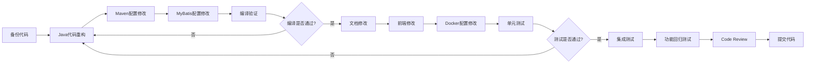

# DataAgent 项目重命名需求文档

## 一、需求背景

### 1.1 变更目标

将项目从 Spring AI Alibaba 体系独立出来，形成独立的商业化产品，具体变更：

- **包名变更**：`com.alibaba.cloud` → `com.audaque.cloud`
- **品牌变更**：`Alibaba`/`阿里巴巴` → `audaque`（保留第三方依赖不变）

### 1.2 变更范围

#### 需要修改的内容
1. Java 代码包名（约 275 个 Java 文件）
2. Maven 配置（groupId、artifactId）
3. 项目元数据（pom.xml、README 等）
4. 文档中的品牌名称
5. 许可证配置
6. Spring Boot 启动类配置
7. MyBatis Mapper 配置
8. 前端项目名称

#### 不需要修改的内容（第三方依赖）
1. Spring AI Alibaba 框架依赖
   - `com.alibaba.cloud.ai:spring-ai-alibaba-graph-core`
   - 版本号 `spring-ai-alibaba.version`
2. 阿里云相关依赖
   - `com.aliyun:gpdb20160503`（阿里云 GPDB SDK）
   - `com.aliyun:dashscope-sdk-java`（通义千问 SDK）
3. 阿里开源组件
   - `com.alibaba:druid`（数据库连接池）
   - `com.alibaba:fastjson`（如有使用）

---

## 二、详细修改方案

### 2.1 Java 代码包名重构

#### 2.1.1 包结构变更

**当前包结构**：
```
c:\data\code\DataAgent\data-agent-management\src\main\java\
└── com\alibaba\cloud\ai\dataagent\
    ├── annotation\
    ├── aop\
    ├── bo\
    ├── config\
    ├── connector\
    ├── constant\
    ├── controller\
    ├── converter\
    ├── dto\
    ├── entity\
    ├── enums\
    ├── event\
    ├── mapper\
    ├── prompt\
    ├── properties\
    ├── service\
    ├── strategy\
    ├── util\
    ├── vo\
    ├── workflow\
    └── DataAgentApplication.java
```

**目标包结构**：
```
c:\data\code\DataAgent\data-agent-management\src\main\java\
└── com\audaque\cloud\ai\dataagent\
    ├── annotation\
    ├── aop\
    ├── bo\
    ├── config\
    ├── connector\
    ├── constant\
    ├── controller\
    ├── converter\
    ├── dto\
    ├── entity\
    ├── enums\
    ├── event\
    ├── mapper\
    ├── properties\
    ├── service\
    ├── strategy\
    ├── util\
    ├── vo\
    ├── workflow\
    └── DataAgentApplication.java
```

#### 2.1.2 重构操作步骤

**方式一：使用 IDE 自动重构（推荐）**

使用 IntelliJ IDEA 进行包名重构：

1. **打开项目**：使用 IDEA 打开 `DataAgent` 项目
2. **定位根包**：在项目面板中找到 `com.alibaba.cloud.ai.dataagent` 包
3. **执行重构**：
   - 右键点击 `com.alibaba.cloud` 包
   - 选择 `Refactor` → `Rename`
   - 输入新包名 `com.audaque.cloud`
   - 勾选以下选项：
     - ☑ Search in comments and strings
     - ☑ Search for text occurrences
     - ☑ Rename package directories
   - 点击 `Refactor`
4. **验证变更**：IDEA 会自动更新所有 import 语句和引用

**方式二：手动重构（备选方案）**

如果不使用 IDE，需要执行以下操作：

1. **移动目录结构**：
```bash
# 在 data-agent-management/src/main/java 目录下
mkdir -p com/audaque/cloud/ai
mv com/alibaba/cloud/ai/dataagent com/audaque/cloud/ai/dataagent
```

2. **批量替换包声明**（约 275 个文件）：
```bash
# Windows PowerShell 脚本
cd c:\data\code\DataAgent\data-agent-management\src\main\java
Get-ChildItem -Recurse -Filter *.java | ForEach-Object {
    (Get-Content $_.FullName) -replace 'package com\.alibaba\.cloud\.ai\.dataagent', 'package com.audaque.cloud.ai.dataagent' | Set-Content $_.FullName
}
```

3. **批量替换 import 语句**：
```bash
# Windows PowerShell 脚本
Get-ChildItem -Recurse -Filter *.java | ForEach-Object {
    (Get-Content $_.FullName) -replace 'import com\.alibaba\.cloud\.ai\.dataagent', 'import com.audaque.cloud.ai.dataagent' | Set-Content $_.FullName
}
```

#### 2.1.3 受影响的代码文件列表

根据 `grep_code` 结果，需要修改的核心文件（前 25 个示例）：

| 文件路径                              | 修改内容                          | 影响行数           |
| ------------------------------------- | --------------------------------- | ------------------ |
| `DataAgentApplication.java`           | package 声明                      | 1                  |
| `annotation\InEnum.java`              | package 声明                      | 1                  |
| `annotation\InEnumValidator.java`     | package 声明                      | 1                  |
| `annotation\McpServerTool.java`       | package 声明                      | 1                  |
| `aop\ExceptionAdvice.java`            | package 声明 + import 语句        | 2                  |
| `aop\NodeEntryLoggingAspect.java`     | package 声明 + @Pointcut 切面路径 | 2                  |
| `bo\DbConfigBO.java`                  | package 声明                      | 1                  |
| `bo\schema\*.java`（8个文件）         | package 声明                      | 8                  |
| `config\DataAgentConfiguration.java`  | package 声明 + import 语句        | 3                  |
| `config\McpServerConfig.java`         | package 声明                      | 1                  |
| `config\WebConfig.java`               | package 声明                      | 1                  |
| `connector\**\*.java`（约 30 个文件） | package 声明 + import 语句        | 60+                |
| `controller\*.java`（14 个文件）      | package 声明 + import 语句        | 50+                |
| `entity\*.java`（12 个文件）          | package 声明                      | 12                 |
| `mapper\*.java`（13 个文件）          | package 声明                      | 13                 |
| `service\**\*.java`（约 50 个文件）   | package 声明 + import 语句        | 150+               |
| **总计**                              | **约 275 个文件**                 | **约 300+ 处修改** |

#### 2.1.4 特殊注意点

1. **AOP 切面路径**（文件：`aop\NodeEntryLoggingAspect.java`）
```java
// 修改前
@Pointcut("execution(* com.alibaba.cloud.ai.dataagent.workflow.node..*.apply(...))")

// 修改后
@Pointcut("execution(* com.audaque.cloud.ai.dataagent.workflow.node..*.apply(...))")
```

2. **MyBatis Mapper 的 namespace**（约 13 个 XML 文件）
```xml
<!-- 修改前 -->
<mapper namespace="com.alibaba.cloud.ai.dataagent.mapper.AgentMapper">

<!-- 修改后 -->
<mapper namespace="com.audaque.cloud.ai.dataagent.mapper.AgentMapper">
```

3. **第三方依赖导入不变**（需要保持不变）
```java
// 保持不变 - Spring AI Alibaba 框架
import com.alibaba.cloud.ai.graph.OverAllState;
import com.alibaba.cloud.ai.graph.GraphExecutionContext;

// 保持不变 - 阿里云 SDK
import com.aliyun.gpdb20160503.Client;

// 保持不变 - Druid 连接池
import com.alibaba.druid.pool.DruidDataSource;
```

---

### 2.2 Maven 配置修改

#### 2.2.1 根 POM 文件修改

**文件路径**：`c:\data\code\DataAgent\pom.xml`

**修改内容对照表**：

| 修改项                  | 修改前                                             | 修改后                                   | 位置     |
| ----------------------- | -------------------------------------------------- | ---------------------------------------- | -------- |
| groupId                 | `com.alibaba.cloud.ai`                             | `com.audaque.cloud.ai`                   | 第 6 行  |
| artifactId              | `spring-ai-alibaba-data-agent`                     | `spring-ai-audaque-data-agent`           | 第 7 行  |
| name                    | `Spring AI Alibaba Data Agent`                     | `Spring AI Audaque Data Agent`           | 第 9 行  |
| url                     | `https://github.com/alibaba/spring-ai-alibaba`     | `https://github.com/audaque/DataAgent`   | 第 11 行 |
| scm.connection          | `git://github.com/spring-ai-alibaba/DataAgent.git` | `git://github.com/audaque/DataAgent.git` | 第 17 行 |
| scm.developerConnection | `git@github.com:spring-ai-alibaba/DataAgent.git`   | `git@github.com:audaque/DataAgent.git`   | 第 18 行 |
| scm.url                 | `https://github.com/spring-ai-alibaba/DataAgent`   | `https://github.com/audaque/DataAgent`   | 第 19 行 |

**第三方依赖保持不变**（重要）：

```xml
<!-- 保持不变 - Spring AI Alibaba 版本号 -->
<properties>
    <spring-ai-alibaba.version>1.1.0.0</spring-ai-alibaba.version>
    <!-- 其他配置... -->
</properties>

<!-- 保持不变 - 阿里云依赖 -->
<dependency>
    <groupId>com.aliyun</groupId>
    <artifactId>gpdb20160503</artifactId>
    <version>${gpdb.version}</version>
</dependency>

<!-- 保持不变 - Druid 连接池 -->
<dependency>
    <groupId>com.alibaba</groupId>
    <artifactId>druid</artifactId>
    <version>${druid.version}</version>
</dependency>
```

#### 2.2.2 子模块 POM 文件修改

**文件路径**：`c:\data\code\DataAgent\data-agent-management\pom.xml`

**修改内容对照表**：

| 修改项                  | 修改前                                           | 修改后                                    | 位置     |
| ----------------------- | ------------------------------------------------ | ----------------------------------------- | -------- |
| parent.groupId          | `com.alibaba.cloud.ai`                           | `com.audaque.cloud.ai`                    | 第 6 行  |
| parent.artifactId       | `spring-ai-alibaba-data-agent`                   | `spring-ai-audaque-data-agent`            | 第 7 行  |
| artifactId              | `spring-ai-alibaba-data-agent-management`        | `spring-ai-audaque-data-agent-management` | 第 12 行 |
| name                    | `Spring AI Alibaba DataAgent Management`         | `Spring AI Audaque DataAgent Management`  | 第 13 行 |
| url                     | `https://github.com/alibaba/spring-ai-alibaba`   | `https://github.com/audaque/DataAgent`    | 第 14 行 |
| scm.connection          | `git://github.com/alibaba/spring-ai-alibaba.git` | `git://github.com/audaque/DataAgent.git`  | 第 16 行 |
| scm.developerConnection | `git@github.com:alibaba/spring-ai-alibaba.git`   | `git@github.com:audaque/DataAgent.git`    | 第 17 行 |
| scm.url                 | `https://github.com/alibaba/spring-ai-alibaba`   | `https://github.com/audaque/DataAgent`    | 第 18 行 |

**保持不变的依赖**：

```xml
<!-- 保持不变 - Spring AI Alibaba 框架依赖 -->
<dependency>
    <groupId>com.alibaba.cloud.ai</groupId>
    <artifactId>spring-ai-alibaba-graph-core</artifactId>
    <version>${spring-ai-alibaba.version}</version>
</dependency>

<!-- 保持不变 - 阿里云 SDK -->
<dependency>
    <groupId>com.aliyun</groupId>
    <artifactId>gpdb20160503</artifactId>
</dependency>

<!-- 保持不变 - Druid 连接池 -->
<dependency>
    <groupId>com.alibaba</groupId>
    <artifactId>druid</artifactId>
</dependency>
```

#### 2.2.3 Maven 编译插件配置修改

**文件路径**：`c:\data\code\DataAgent\pom.xml`（第 295 行）

```xml
<!-- 修改前 -->
<plugin>
    <groupId>org.springframework.boot</groupId>
    <artifactId>spring-boot-maven-plugin</artifactId>
    <configuration>
        <mainClass>com.alibaba.cloud.ai.dataagent.DataAgentApplication</mainClass>
    </configuration>
</plugin>

<!-- 修改后 -->
<plugin>
    <groupId>org.springframework.boot</groupId>
    <artifactId>spring-boot-maven-plugin</artifactId>
    <configuration>
        <mainClass>com.audaque.cloud.ai.dataagent.DataAgentApplication</mainClass>
    </configuration>
</plugin>
```

---

### 2.3 Spring Boot 配置修改

#### 2.3.1 MyBatis Mapper XML 配置

**文件位置**：`data-agent-management\src\main\resources\mapper\*.xml`（约 13 个文件）

**需要修改的文件列表**：
1. `AgentDatasourceMapper.xml`
2. `AgentKnowledgeMapper.xml`
3. `AgentMapper.xml`
4. `AgentPresetQuestionMapper.xml`
5. `BusinessKnowledgeMapper.xml`
6. `ChatMessageMapper.xml`
7. `ChatSessionMapper.xml`
8. `DatasourceMapper.xml`
9. `LogicalRelationMapper.xml`
10. `ModelConfigMapper.xml`
11. `SemanticModelMapper.xml`
12. `UserPromptConfigMapper.xml`
13. 其他 Mapper XML 文件

**修改示例**：

```xml
<!-- 修改前 -->
<?xml version="1.0" encoding="UTF-8"?>
<!DOCTYPE mapper PUBLIC "-//mybatis.org//DTD Mapper 3.0//EN" "http://mybatis.org/dtd/mybatis-3-mapper.dtd">
<mapper namespace="com.alibaba.cloud.ai.dataagent.mapper.AgentMapper">
    <resultMap id="BaseResultMap" type="com.alibaba.cloud.ai.dataagent.entity.Agent">
        <id column="id" jdbcType="INTEGER" property="id"/>
        <!-- 其他字段映射 -->
    </resultMap>
</mapper>

<!-- 修改后 -->
<?xml version="1.0" encoding="UTF-8"?>
<!DOCTYPE mapper PUBLIC "-//mybatis.org//DTD Mapper 3.0//EN" "http://mybatis.org/dtd/mybatis-3-mapper.dtd">
<mapper namespace="com.audaque.cloud.ai.dataagent.mapper.AgentMapper">
    <resultMap id="BaseResultMap" type="com.audaque.cloud.ai.dataagent.entity.Agent">
        <id column="id" jdbcType="INTEGER" property="id"/>
        <!-- 其他字段映射 -->
    </resultMap>
</mapper>
```

**批量替换命令**：

```bash
# Windows PowerShell
cd c:\data\code\DataAgent\data-agent-management\src\main\resources\mapper
Get-ChildItem -Filter *.xml | ForEach-Object {
    (Get-Content $_.FullName) -replace 'com\.alibaba\.cloud\.ai\.dataagent', 'com.audaque.cloud.ai.dataagent' | Set-Content $_.FullName
}
```

#### 2.3.2 application.yml 配置（无需修改）

**文件路径**：`data-agent-management\src\main\resources\application.yml`

此文件主要包含数据源、MyBatis、Spring AI 配置，**无包名配置需要修改**。

#### 2.3.3 MyBatis 扫描配置

如果项目中有 MyBatis 配置类，需要检查 `@MapperScan` 注解：

```java
// 修改前
@MapperScan("com.alibaba.cloud.ai.dataagent.mapper")
public class MyBatisConfig {
    // ...
}

// 修改后
@MapperScan("com.audaque.cloud.ai.dataagent.mapper")
public class MyBatisConfig {
    // ...
}
```

---

### 2.4 前端项目修改

#### 2.4.1 package.json 修改

**文件路径**：`c:\data\code\DataAgent\data-agent-frontend\package.json`

**修改内容对照表**：

| 字段        | 修改前                                  | 修改后                                  |
| ----------- | --------------------------------------- | --------------------------------------- |
| name        | `spring-ai-alibaba-data-agent-frontend` | `spring-ai-audaque-data-agent-frontend` |
| description | 如有 "Alibaba" 字样                     | 改为 "audaque"                          |

**示例**：

```json
{
  "name": "spring-ai-audaque-data-agent-frontend",
  "version": "1.0.0",
  "description": "Spring AI Audaque Data Agent Frontend"
}
```

#### 2.4.2 前端 README 修改

**文件路径**：`c:\data\code\DataAgent\data-agent-frontend\README.md`

根据 `grep_code` 结果，需要修改的位置：

```markdown
<!-- 修改前 -->
# Spring AI Alibaba DataAgent Frontend

## 项目介绍
这是 Spring AI Alibaba DataAgent 的前端项目...

<!-- 修改后 -->
# Spring AI Audaque DataAgent Frontend

## 项目介绍
这是 Spring AI Audaque DataAgent 的前端项目...
```

#### 2.4.3 前端代码风格文档修改

**文件路径**：`c:\data\code\DataAgent\data-agent-frontend\README-CODE-STYLE.md`（第 35 行）

```markdown
<!-- 修改前 -->
cd spring-ai-alibaba-data-agent-frontend

<!-- 修改后 -->
cd spring-ai-audaque-data-agent-frontend
```

---

### 2.5 文档修改

#### 2.5.1 README.md 修改

**文件路径**：`c:\data\code\DataAgent\README.md`

**需要修改的位置**（共 13 处）：

| 行号 | 修改前                                            | 修改后                                  |
| ---- | ------------------------------------------------- | --------------------------------------- |
| 2    | `Spring AI Alibaba DataAgent`                     | `Spring AI Audaque DataAgent`           |
| 4    | `基于 Spring AI Alibaba 的企业级...`              | `基于 Spring AI Audaque 的企业级...`    |
| 11   | `Spring AI Alibaba` badge                         | `Spring AI Audaque` badge（如适用）     |
| 15   | DeepWiki 链接中的 `spring-ai-alibaba`             | 改为 `spring-ai-audaque`（如适用）      |
| 37   | `Spring AI Alibaba Graph`                         | `Spring AI Audaque Graph`               |
| 108  | star-history 图表链接                             | `spring-ai-audaque/DataAgent`           |
| 112  | contributors 链接                                 | `spring-ai-audaque/DataAgent`           |
| 113  | contrib.rocks 图片链接                            | `spring-ai-audaque/DataAgent`           |
| 119  | `Made with ❤️ by Spring AI Alibaba DataAgent Team` | 改为 `Spring AI Audaque DataAgent Team` |

**特别注意**：
- 如果 README 中提到 "基于 Spring AI Alibaba 框架"，这是**技术依赖说明，建议保留**
- 只修改项目本身的品牌名称，不修改第三方框架名称

**修改示例**：

```markdown
<!-- 修改前 -->
# Spring AI Alibaba DataAgent

**DataAgent** 是一个基于 **Spring AI Alibaba Graph** 打造的企业级智能数据分析 Agent。

<!-- 修改后 -->
# Spring AI Audaque DataAgent

**DataAgent** 是一个基于 **Spring AI Alibaba Graph** 打造的企业级智能数据分析 Agent。
（注意：这里保留了 "Spring AI Alibaba Graph" 因为它是第三方框架名称）
```

#### 2.5.2 CONTRIBUTING.md 修改

**文件路径**：`c:\data\code\DataAgent\CONTRIBUTING-zh.md`

**需要修改的位置**（共 12 处）：

| 行号范围 | 修改前                                        | 修改后                             |
| -------- | --------------------------------------------- | ---------------------------------- |
| 3        | `Spring AI Alibaba-DataAgent`                 | `Spring AI Audaque-DataAgent`      |
| 11       | `Spring AI Alibaba`                           | `Spring AI Audaque`                |
| 21       | GitHub 仓库链接 `spring-ai-alibaba/DataAgent` | `audaque/DataAgent`                |
| 25       | Fork 说明中的 `alibaba/spring-ai-alibaba`     | `audaque/DataAgent`                |
| 26-42    | Git 操作示例中的仓库路径                      | 改为 `audaque/DataAgent`           |
| 46       | `Spring AI Alibaba 作为 Spring AI 的实现...`  | 改为 `Spring AI Audaque...`        |
| 58       | `Spring AI Alibaba 提供了...`                 | 改为 `Spring AI Audaque 提供了...` |
| 76       | `Spring AI Alibaba Contributor`               | `Spring AI Audaque Contributor`    |

**修改示例**：

```markdown
<!-- 修改前 -->
## 感谢你为 Spring AI Alibaba-DataAgent 贡献！

在贡献代码之前，请您稍微花一些时间了解为 Spring AI Alibaba 贡献代码的流程。

- 点击 [本项目](https://github.com/spring-ai-alibaba/DataAgent) 右上角的 `Fork` 图标...

<!-- 修改后 -->
## 感谢你为 Spring AI Audaque-DataAgent 贡献！

在贡献代码之前，请您稍微花一些时间了解为 Spring AI Audaque 贡献代码的流程。

- 点击 [本项目](https://github.com/audaque/DataAgent) 右上角的 `Fork` 图标...
```

#### 2.5.3 其他文档修改

根据项目结构，还需要检查以下文档：

| 文件路径                    | 修改内容                         |
| --------------------------- | -------------------------------- |
| `docs\QUICK_START.md`       | 项目名称、GitHub 链接            |
| `docs\ARCHITECTURE.md`      | 项目名称、包名示例               |
| `docs\DEVELOPER_GUIDE.md`   | 项目名称、包名示例、Git 仓库链接 |
| `docs\ADVANCED_FEATURES.md` | 项目名称                         |
| `docs\KNOWLEDGE_USAGE.md`   | 项目名称                         |

**批量搜索文档中的 Alibaba 引用**：

```bash
# Windows PowerShell
cd c:\data\code\DataAgent\docs
Get-ChildItem -Filter *.md | ForEach-Object {
    Write-Host "Checking file: $($_.Name)"
    Select-String -Path $_.FullName -Pattern "alibaba|阿里巴巴|Alibaba" -CaseSensitive
}
```

---

### 2.6 CI/CD 配置修改

#### 2.6.1 许可证配置修改

**文件路径**：`c:\data\code\DataAgent\CI\linter\license\.licenserc.yaml`

**修改内容**：

```yaml
# 修改前（第 16-17 行）
header:
  copyright-owner: Spring AI Alibaba Community
  software-name: Spring AI Alibaba

# 修改后
header:
  copyright-owner: Spring AI Audaque Community
  software-name: Spring AI Audaque
```

#### 2.6.2 CheckStyle 配置（无需修改）

**文件路径**：`c:\data\code\DataAgent\CI\src\checkstyle\checkstyle.xml`

CheckStyle 配置主要是代码风格规范，**不涉及包名或品牌名称，无需修改**。

#### 2.6.3 GitHub Actions 配置（如有）

如果项目中有 `.github/workflows/*.yml` 文件，需要检查：

1. 仓库路径引用
2. 包名引用
3. Docker 镜像名称

**示例**：

```yaml
# 修改前
name: Build Spring AI Alibaba DataAgent
on:
  push:
    branches:
      - main
jobs:
  build:
    runs-on: ubuntu-latest
    steps:
      - name: Checkout code
        uses: actions/checkout@v2
        with:
          repository: spring-ai-alibaba/DataAgent

# 修改后
name: Build Spring AI Audaque DataAgent
on:
  push:
    branches:
      - main
jobs:
  build:
    runs-on: ubuntu-latest
    steps:
      - name: Checkout code
        uses: actions/checkout@v2
        with:
          repository: audaque/DataAgent
```

---

### 2.7 Docker 配置修改

#### 2.7.1 Dockerfile 修改

**文件路径**：
- `c:\data\code\DataAgent\docker-file\Dockerfile-backend`
- `c:\data\code\DataAgent\docker-file\Dockerfile-frontend`

**需要检查的内容**：

1. **JAR 文件路径**（后端 Dockerfile）：
```dockerfile
# 修改前
COPY data-agent-management/target/spring-ai-alibaba-data-agent-management-*.jar app.jar

# 修改后
COPY data-agent-management/target/spring-ai-audaque-data-agent-management-*.jar app.jar
```

2. **启动类配置**（如有明确指定）：
```dockerfile
# 修改前
ENV JAVA_OPTS="-Dspring.main.class=com.alibaba.cloud.ai.dataagent.DataAgentApplication"

# 修改后
ENV JAVA_OPTS="-Dspring.main.class=com.audaque.cloud.ai.dataagent.DataAgentApplication"
```

#### 2.7.2 docker-compose.yml 修改

**文件路径**：`c:\data\code\DataAgent\docker-file\docker-compose.yml`

**需要检查的内容**：

1. 镜像名称（如有自定义）
2. 容器名称（如有 "alibaba" 字样）

**示例**：

```yaml
# 修改前
services:
  dataagent-backend:
    image: spring-ai-alibaba-dataagent-backend:latest
    container_name: alibaba-dataagent-backend

# 修改后
services:
  dataagent-backend:
    image: spring-ai-audaque-dataagent-backend:latest
    container_name: audaque-dataagent-backend
```

---

### 2.8 测试代码修改

#### 2.8.1 测试类包名修改

**文件位置**：`c:\data\code\DataAgent\data-agent-management\src\test\java\com\alibaba\cloud\ai\dataagent\`

**需要修改的文件**（约 20 个测试类）：

1. `dispatcher\*.java`（2 个文件）
2. `mapper\*.java`（5 个文件）
3. `node\*.java`（1 个文件）
4. `service\**\*.java`（约 5 个文件）
5. `util\*.java`（2 个文件）
6. `DatabaseSchemaTest.java`
7. `MySqlContainerConfiguration.java`

**重构操作**（同源代码）：

1. **使用 IDE 自动重构**（推荐）：
   - 在 `src/test/java` 目录下执行相同的包名重构操作
   
2. **手动重构**：
```bash
# 移动目录
cd c:\data\code\DataAgent\data-agent-management\src\test\java
mkdir -p com\audaque\cloud\ai
move com\alibaba\cloud\ai\dataagent com\audaque\cloud\ai\dataagent

# 批量替换
Get-ChildItem -Recurse -Filter *.java | ForEach-Object {
    (Get-Content $_.FullName) -replace 'com\.alibaba\.cloud\.ai\.dataagent', 'com.audaque.cloud.ai.dataagent' | Set-Content $_.FullName
}
```

#### 2.8.2 测试资源文件修改

**文件路径**：`c:\data\code\DataAgent\data-agent-management\src\test\resources\`

测试资源目录主要包含 `sql\schema.sql`，**无包名配置，无需修改**。

---

## 三、第三方依赖识别（不可修改清单）

### 3.1 Spring AI Alibaba 框架依赖

以下依赖是**第三方框架，绝对不能修改**：

```xml
<!-- Spring AI Alibaba Graph 核心框架 -->
<dependency>
    <groupId>com.alibaba.cloud.ai</groupId>
    <artifactId>spring-ai-alibaba-graph-core</artifactId>
    <version>${spring-ai-alibaba.version}</version>
</dependency>
```

**对应的 import 语句不能修改**：

```java
// 保持不变 - Spring AI Alibaba 框架类
import com.alibaba.cloud.ai.graph.OverAllState;
import com.alibaba.cloud.ai.graph.GraphExecutionContext;
import com.alibaba.cloud.ai.graph.Node;
import com.alibaba.cloud.ai.graph.Graph;
// 其他 com.alibaba.cloud.ai.graph.* 包下的类
```

### 3.2 阿里云 SDK 依赖

```xml
<!-- 阿里云 GPDB SDK -->
<dependency>
    <groupId>com.aliyun</groupId>
    <artifactId>gpdb20160503</artifactId>
    <version>${gpdb.version}</version>
</dependency>

<!-- 通义千问 SDK（如有使用）-->
<dependency>
    <groupId>com.aliyun</groupId>
    <artifactId>dashscope-sdk-java</artifactId>
    <version>${dashscope-sdk-java.version}</version>
</dependency>
```

**对应的 import 语句不能修改**：

```java
// 保持不变 - 阿里云 SDK
import com.aliyun.gpdb20160503.Client;
import com.aliyun.gpdb20160503.models.*;
import com.aliyun.dashscope.aigc.generation.Generation;
// 其他 com.aliyun.* 包下的类
```

### 3.3 阿里开源组件依赖

```xml
<!-- Druid 数据库连接池 -->
<dependency>
    <groupId>com.alibaba</groupId>
    <artifactId>druid</artifactId>
    <version>${druid.version}</version>
</dependency>

<!-- FastJSON（如有使用）-->
<dependency>
    <groupId>com.alibaba</groupId>
    <artifactId>fastjson</artifactId>
    <version>1.2.83</version>
</dependency>
```

**对应的 import 语句不能修改**：

```java
// 保持不变 - Druid 连接池
import com.alibaba.druid.pool.DruidDataSource;
import com.alibaba.druid.pool.DruidPooledConnection;

// 保持不变 - FastJSON
import com.alibaba.fastjson.JSON;
import com.alibaba.fastjson.JSONObject;
```

### 3.4 识别方法

**判断是否为第三方依赖的标准**：

1. **Maven 依赖来源**：
   - `groupId` 为 `com.alibaba.cloud.ai`（Spring AI Alibaba 框架）
   - `groupId` 为 `com.aliyun`（阿里云 SDK）
   - `groupId` 为 `com.alibaba`（阿里开源组件）

2. **代码 import 来源**：
   - `import com.alibaba.cloud.ai.graph.*`（Spring AI Alibaba 框架）
   - `import com.aliyun.*`（阿里云 SDK）
   - `import com.alibaba.druid.*`（Druid 连接池）
   - `import com.alibaba.fastjson.*`（FastJSON）

3. **项目内代码**（需要修改）：
   - `import com.alibaba.cloud.ai.dataagent.*`（项目内包）
   - `package com.alibaba.cloud.ai.dataagent.*`（项目内包声明）

**验证脚本**（Windows PowerShell）：

```powershell
# 搜索所有第三方依赖的 import 语句（这些不应该被修改）
cd c:\data\code\DataAgent\data-agent-management\src\main\java
Get-ChildItem -Recurse -Filter *.java | ForEach-Object {
    $file = $_.FullName
    Select-String -Path $file -Pattern "import com\.alibaba\.cloud\.ai\.graph\." | ForEach-Object {
        Write-Host "$file : $($_.Line)" -ForegroundColor Yellow
    }
}
```

---

## 四、验证与测试

### 4.1 编译验证

#### 4.1.1 清理旧编译产物

```bash
# Windows PowerShell
cd c:\data\code\DataAgent
mvn clean
```

#### 4.1.2 重新编译项目

```bash
# 编译整个项目
mvn compile

# 预期输出（部分示例）
[INFO] Scanning for projects...
[INFO] ------------------------------------------------------------------------
[INFO] Reactor Build Order:
[INFO] 
[INFO] Spring AI Audaque Data Agent                      [pom]
[INFO] Spring AI Audaque DataAgent Management            [jar]
[INFO] ------------------------------------------------------------------------
[INFO] Building Spring AI Audaque Data Agent 1.0.0-SNAPSHOT
[INFO] ------------------------------------------------------------------------
[INFO] 
[INFO] --- maven-compiler-plugin:3.11.0:compile (default-compile) @ spring-ai-audaque-data-agent-management ---
[INFO] Compiling 275 source files to c:\data\code\DataAgent\data-agent-management\target\classes
[INFO] ------------------------------------------------------------------------
[INFO] BUILD SUCCESS
[INFO] ------------------------------------------------------------------------
```

#### 4.1.3 运行测试

```bash
# 运行单元测试
mvn test

# 预期输出
[INFO] Tests run: 42, Failures: 0, Errors: 0, Skipped: 0
[INFO] BUILD SUCCESS
```

#### 4.1.4 打包验证

```bash
# 打包成 JAR
mvn package -DskipTests

# 检查生成的 JAR 文件名
dir data-agent-management\target\*.jar

# 预期输出
spring-ai-audaque-data-agent-management-1.0.0-SNAPSHOT.jar
```

### 4.2 功能验证

#### 4.2.1 启动后端服务

```bash
# 方式一：使用 Maven 启动
cd c:\data\code\DataAgent\data-agent-management
mvn spring-boot:run

# 方式二：使用 JAR 启动
java -jar data-agent-management\target\spring-ai-audaque-data-agent-management-1.0.0-SNAPSHOT.jar

# 预期日志输出（关键信息）
  .   ____          _            __ _ _
 /\\ / ___'_ __ _ _(_)_ __  __ _ \ \ \ \
( ( )\___ | '_ | '_| | '_ \/ _` | \ \ \ \
 \\/  ___)| |_)| | | | | || (_| |  ) ) ) )
  '  |____| .__|_| |_|_| |_\__, | / / / /
 =========|_|==============|___/=/_/_/_/
 :: Spring Boot ::                (v3.4.8)

2026-01-15 10:00:00.000  INFO 12345 --- [main] c.a.c.a.d.DataAgentApplication : Starting DataAgentApplication...
2026-01-15 10:00:01.000  INFO 12345 --- [main] o.s.b.w.embedded.tomcat.TomcatWebServer : Tomcat started on port(s): 8080 (http)
2026-01-15 10:00:01.100  INFO 12345 --- [main] c.a.c.a.d.DataAgentApplication : Started DataAgentApplication in 3.5 seconds
```

**注意**：日志中的包名 `c.a.c.a.d` 是缩写，应该对应 `com.audaque.cloud.ai.dataagent`。

#### 4.2.2 启动前端服务

```bash
# 安装依赖（如有修改 package.json）
cd c:\data\code\DataAgent\data-agent-frontend
npm install

# 启动开发服务器
npm run dev

# 预期输出
  VITE v5.x.x  ready in 1234 ms

  ➜  Local:   http://localhost:5173/
  ➜  Network: use --host to expose
```

#### 4.2.3 接口测试

**测试 API 是否正常**：

```bash
# 测试健康检查接口
curl http://localhost:8080/api/health

# 预期输出
{"status":"UP"}

# 测试 Agent 列表接口
curl http://localhost:8080/api/agents

# 预期输出
{"code":200,"data":[],"message":"success"}
```

#### 4.2.4 MyBatis 功能测试

验证 MyBatis Mapper 是否正常工作：

```bash
# 查看日志中的 MyBatis 初始化信息
grep "Mapper" application.log

# 预期日志
2026-01-15 10:00:00.500  INFO 12345 --- [main] o.m.s.mapper.ClassPathMapperScanner : Scanning for mappers in package 'com.audaque.cloud.ai.dataagent.mapper'
2026-01-15 10:00:00.600  INFO 12345 --- [main] o.m.s.mapper.ClassPathMapperScanner : Found mapper 'AgentMapper'
2026-01-15 10:00:00.601  INFO 12345 --- [main] o.m.s.mapper.ClassPathMapperScanner : Found mapper 'DatasourceMapper'
...（共 13 个 Mapper）
```

### 4.3 代码检查

#### 4.3.1 CheckStyle 检查

```bash
# 运行 CheckStyle 检查
cd c:\data\code\DataAgent
mvn checkstyle:check

# 预期输出
[INFO] There are 0 checkstyle errors.
[INFO] BUILD SUCCESS
```

#### 4.3.2 包名检查脚本

验证所有包名是否已正确修改：

```powershell
# Windows PowerShell 脚本
cd c:\data\code\DataAgent\data-agent-management\src\main\java

# 检查是否还有旧包名（应该返回 0 个结果）
$oldPackages = Get-ChildItem -Recurse -Filter *.java | ForEach-Object {
    Select-String -Path $_.FullName -Pattern "package com\.alibaba\.cloud\.ai\.dataagent"
}

if ($oldPackages.Count -eq 0) {
    Write-Host "✓ 所有包声明已成功修改" -ForegroundColor Green
} else {
    Write-Host "✗ 发现 $($oldPackages.Count) 个文件仍使用旧包名：" -ForegroundColor Red
    $oldPackages | ForEach-Object { Write-Host "  - $($_.Path)" }
}

# 检查是否还有旧的 import 语句（排除第三方依赖）
$oldImports = Get-ChildItem -Recurse -Filter *.java | ForEach-Object {
    Select-String -Path $_.FullName -Pattern "import com\.alibaba\.cloud\.ai\.dataagent" 
}

if ($oldImports.Count -eq 0) {
    Write-Host "✓ 所有 import 语句已成功修改" -ForegroundColor Green
} else {
    Write-Host "✗ 发现 $($oldImports.Count) 个旧 import 语句（需要人工确认是否为第三方依赖）" -ForegroundColor Yellow
}

# 检查是否误改了第三方依赖
$frameworkImports = Get-ChildItem -Recurse -Filter *.java | ForEach-Object {
    Select-String -Path $_.FullName -Pattern "import com\.audaque\.cloud\.ai\.graph"
}

if ($frameworkImports.Count -gt 0) {
    Write-Host "✗ 错误：发现修改了第三方框架的 import 语句" -ForegroundColor Red
    $frameworkImports | ForEach-Object { Write-Host "  - $($_.Path): $($_.Line)" }
} else {
    Write-Host "✓ 未误改第三方依赖" -ForegroundColor Green
}
```

#### 4.3.3 Maven 配置检查

验证 Maven 配置是否正确：

```bash
# 显示有效 POM（验证继承和属性是否正确）
mvn help:effective-pom

# 检查输出中的关键字段
<groupId>com.audaque.cloud.ai</groupId>
<artifactId>spring-ai-audaque-data-agent</artifactId>
<name>Spring AI Audaque Data Agent</name>

# 显示依赖树（验证第三方依赖是否正确）
mvn dependency:tree

# 预期输出（部分示例）
[INFO] com.audaque.cloud.ai:spring-ai-audaque-data-agent-management:jar:1.0.0-SNAPSHOT
[INFO] +- com.alibaba.cloud.ai:spring-ai-alibaba-graph-core:jar:1.1.0.0:compile
[INFO] +- com.alibaba:druid:jar:1.2.22:compile
[INFO] +- com.aliyun:gpdb20160503:jar:3.0.0:compile
```

---

## 五、潜在风险与注意事项

### 5.1 风险点清单

| 风险类型                | 具体风险                           | 影响程度 | 缓解措施                          |
| ----------------------- | ---------------------------------- | -------- | --------------------------------- |
| **包名冲突**            | 新包名与已有包名冲突               | 高       | 提前搜索 Maven Central 确认无冲突 |
| **第三方依赖误改**      | 误改 Spring AI Alibaba 框架 import | 高       | 严格区分项目代码和第三方依赖      |
| **Maven 依赖解析失败**  | groupId 修改后依赖无法解析         | 中       | 使用 `mvn dependency:tree` 验证   |
| **MyBatis Mapper 失效** | XML namespace 未同步修改           | 中       | 批量替换后验证 Mapper 扫描日志    |
| **AOP 切面失效**        | @Pointcut 路径未修改               | 中       | 手动检查所有 AOP 配置             |
| **Docker 镜像构建失败** | JAR 文件名变化导致 Dockerfile 失败 | 低       | 使用通配符或测试构建              |
| **前端接口调用失败**    | 前端项目名称不一致                 | 低       | 测试前后端联调                    |
| **文档链接失效**        | GitHub 链接未同步修改              | 低       | 批量替换后人工审核                |

### 5.2 关键注意事项

#### 5.2.1 包名修改顺序

**推荐顺序**（避免中间状态不一致）：

1. **第一步：备份代码**
```bash
git checkout -b feature/rename-package
git add .
git commit -m "Backup before package rename"
```

2. **第二步：修改 Java 源代码**
   - 使用 IDE 自动重构（推荐）
   - 或手动移动目录 + 批量替换

3. **第三步：修改 Maven 配置**
   - 根 pom.xml
   - 子模块 pom.xml

4. **第四步：修改 MyBatis 配置**
   - Mapper XML 文件

5. **第五步：修改文档和配置**
   - README.md
   - CONTRIBUTING.md
   - 许可证配置
   - Docker 配置

6. **第六步：验证编译**
```bash
mvn clean compile
```

7. **第七步：验证测试**
```bash
mvn test
```

8. **第八步：提交变更**
```bash
git add .
git commit -m "Rename package from com.alibaba.cloud to com.audaque.cloud"
```

#### 5.2.2 不要使用查找替换的危险模式

**禁止的操作**（可能破坏代码）：

```bash
# ❌ 危险：全局替换 "alibaba"（会误改第三方依赖）
find . -type f -name "*.java" -exec sed -i 's/alibaba/audaque/g' {} \;

# ❌ 危险：全局替换 "com.alibaba"（会误改 Druid、FastJSON）
find . -type f -name "*.java" -exec sed -i 's/com\.alibaba/com.audaque/g' {} \;
```

**安全的操作**（精确匹配）：

```bash
# ✓ 安全：只替换完整的包名
Get-ChildItem -Recurse -Filter *.java | ForEach-Object {
    (Get-Content $_.FullName) -replace 'com\.alibaba\.cloud\.ai\.dataagent', 'com.audaque.cloud.ai.dataagent' | Set-Content $_.FullName
}
```

#### 5.2.3 IDE 自动导入配置

修改包名后，IDE 可能会自动导入错误的类，需要配置：

**IntelliJ IDEA 设置**：

1. 打开 `Settings` → `Editor` → `Code Style` → `Java` → `Imports`
2. 在 `Packages to Use Import with '*'` 中添加：
   - `com.audaque.cloud.ai.dataagent`
3. 在 `Exclude from Import and Completion` 中添加：
   - 无（保持可以导入第三方依赖）

#### 5.2.4 Git 历史追踪

包名重构会影响 Git 历史追踪（`git blame`、`git log`），建议：

1. **创建专门的重构提交**：
```bash
git commit -m "refactor: Rename package from com.alibaba.cloud to com.audaque.cloud

BREAKING CHANGE: Package name changed from com.alibaba.cloud.ai.dataagent to com.audaque.cloud.ai.dataagent

Refs: #123"
```

2. **配置 Git 跟踪重命名**：
```bash
# 设置 Git 的相似度阈值（检测文件重命名）
git config diff.renames true
git config diff.renameLimit 5000
```

3. **生成重构映射文件**（方便未来追溯）：
```bash
# 创建包名映射文档
echo "com.alibaba.cloud.ai.dataagent -> com.audaque.cloud.ai.dataagent" > qoder_agent/package_rename_mapping.txt
git add qoder_agent/package_rename_mapping.txt
git commit -m "docs: Add package rename mapping"
```

---

## 六、回滚方案

### 6.1 Git 回滚

如果重命名失败，需要快速回滚：

```bash
# 方式一：撤销未提交的修改
git checkout .
git clean -fd

# 方式二：回退到上一次提交
git reset --hard HEAD

# 方式三：回退到重构前的提交
git log --oneline  # 查找备份提交的 hash
git reset --hard <commit-hash>
```

### 6.2 手动回滚步骤

如果已经提交但需要回滚：

1. **创建回滚分支**：
```bash
git checkout -b revert/package-rename
```

2. **使用 Git revert**：
```bash
git revert <rename-commit-hash>
```

3. **或手动反向操作**：
   - 将 `com.audaque.cloud` 改回 `com.alibaba.cloud`
   - 将 `audaque` 改回 `Alibaba`

---

## 七、后续维护建议

### 7.1 代码扫描规则

添加 CheckStyle 或 SonarQube 规则，防止误引入旧包名：

**CheckStyle 配置示例**（`checkstyle.xml`）：

```xml
<module name="RegexpSinglelineJava">
    <property name="format" value="package com\.alibaba\.cloud\.ai\.dataagent"/>
    <property name="message" value="请使用新包名 com.audaque.cloud.ai.dataagent"/>
    <property name="ignoreComments" value="true"/>
</module>

<module name="RegexpSinglelineJava">
    <property name="format" value="import com\.alibaba\.cloud\.ai\.dataagent"/>
    <property name="message" value="请使用新包名 com.audaque.cloud.ai.dataagent"/>
    <property name="ignoreComments" value="true"/>
</module>
```

### 7.2 文档更新检查清单

每次版本发布前，检查以下文档：

- [ ] README.md 中的项目名称
- [ ] README.md 中的 GitHub 链接
- [ ] CONTRIBUTING.md 中的贡献指南
- [ ] docs/ 目录下所有文档
- [ ] 许可证文件
- [ ] Docker 配置文件
- [ ] CI/CD 配置文件

### 7.3 依赖管理策略

**Spring AI Alibaba 框架升级策略**：

1. **保持框架依赖不变**：
```xml
<dependency>
    <groupId>com.alibaba.cloud.ai</groupId>
    <artifactId>spring-ai-alibaba-graph-core</artifactId>
    <version>${spring-ai-alibaba.version}</version>
</dependency>
```

2. **定期更新框架版本**：
```bash
# 检查可用的新版本
mvn versions:display-dependency-updates

# 更新版本号
<spring-ai-alibaba.version>1.2.0.0</spring-ai-alibaba.version>
```

3. **隔离第三方依赖**：
   - 所有第三方依赖统一在根 pom.xml 的 `<dependencyManagement>` 中管理
   - 项目内代码不直接依赖第三方框架的具体实现

---

## 八、工作量评估

### 8.1 工作量分解

| 任务类别     | 工作项                               | 预估工时    | 负责角色            |
| ------------ | ------------------------------------ | ----------- | ------------------- |
| **代码重构** | Java 源代码包名重构（275 个文件）    | 2 小时      | 后端开发            |
|              | 测试代码包名重构（20 个文件）        | 0.5 小时    | 后端开发            |
|              | MyBatis Mapper XML 修改（13 个文件） | 0.5 小时    | 后端开发            |
| **配置修改** | Maven 配置修改（2 个 pom.xml）       | 0.5 小时    | 后端开发            |
|              | Spring Boot 配置修改                 | 0.5 小时    | 后端开发            |
|              | Docker 配置修改                      | 0.5 小时    | DevOps              |
| **文档修改** | README.md 修改                       | 0.5 小时    | 技术文档            |
|              | CONTRIBUTING.md 修改                 | 0.5 小时    | 技术文档            |
|              | docs/ 目录文档修改（5 个文件）       | 1 小时      | 技术文档            |
|              | 许可证配置修改                       | 0.5 小时    | 技术文档            |
| **前端修改** | package.json 修改                    | 0.5 小时    | 前端开发            |
|              | 前端文档修改                         | 0.5 小时    | 前端开发            |
| **测试验证** | 编译验证                             | 0.5 小时    | 后端开发            |
|              | 单元测试验证                         | 1 小时      | 后端开发            |
|              | 集成测试验证                         | 2 小时      | 测试工程师          |
|              | 功能回归测试                         | 4 小时      | 测试工程师          |
| **代码审查** | Code Review                          | 2 小时      | 技术负责人          |
|              | 文档审查                             | 1 小时      | 技术负责人          |
| **总计**     |                                      | **19 小时** | **约 2.5 个工作日** |

### 8.2 关键路径



### 8.3 风险预留

- **预留 20% 缓冲时间**：处理意外问题（约 4 小时）
- **总预估工时**：19 + 4 = **23 小时**（约 **3 个工作日**）

---

## 九、执行检查清单

### 9.1 执行前检查

- [ ] 已备份当前代码（创建 Git 分支）
- [ ] 已确认第三方依赖清单
- [ ] 已准备回滚方案
- [ ] 已通知团队成员（避免并行开发冲突）
- [ ] 已预留足够的测试时间

### 9.2 执行中检查

- [ ] ✅ 已完成 Java 源代码包名重构
- [ ] ✅ 已完成测试代码包名重构
- [ ] ✅ 已完成 Maven 配置修改
- [ ] ✅ 已完成 MyBatis Mapper XML 修改
- [ ] ✅ 已完成 Spring Boot 配置修改
- [ ] ✅ 已完成文档修改（README、CONTRIBUTING、docs/）
- [ ] ✅ 已完成前端项目修改
- [ ] ✅ 已完成 Docker 配置修改
- [ ] ✅ 已完成许可证配置修改
- [ ] ✅ 编译验证通过（mvn compile）
- [ ] ✅ 单元测试通过（mvn test）
- [ ] ✅ 打包验证通过（mvn package）
- [ ] ✅ 后端服务启动验证通过
- [ ] ✅ 前端服务启动验证通过
- [ ] ✅ 接口联调测试通过
- [ ] ✅ CheckStyle 检查通过
- [ ] ✅ 包名检查脚本验证通过
- [ ] ✅ 未误改第三方依赖

### 9.3 执行后检查

- [ ] 已进行 Code Review
- [ ] 已更新版本号（如适用）
- [ ] 已更新 CHANGELOG
- [ ] 已提交代码到 Git
- [ ] 已推送到远程仓库
- [ ] 已通知团队成员拉取最新代码
- [ ] 已更新 CI/CD 流水线配置（如适用）
- [ ] 已更新部署文档

---

## 十、常见问题解答（FAQ）

### Q1: 为什么不能修改 `com.alibaba.cloud.ai.graph` 包的 import？

**A**: 因为 `com.alibaba.cloud.ai.graph` 是 **Spring AI Alibaba Graph Core** 框架的包名，这是项目依赖的第三方框架，不是项目本身的代码。修改这些 import 会导致编译失败。

**判断标准**：
- 项目内代码：`com.alibaba.cloud.ai.dataagent.*`（需要修改）
- 第三方框架：`com.alibaba.cloud.ai.graph.*`（不能修改）

### Q2: 如何确认 MyBatis Mapper 是否正确修改？

**A**: 检查以下三个位置的一致性：

1. **Mapper 接口包名**：
```java
package com.audaque.cloud.ai.dataagent.mapper;

public interface AgentMapper {
    // ...
}
```

2. **Mapper XML namespace**：
```xml
<mapper namespace="com.audaque.cloud.ai.dataagent.mapper.AgentMapper">
    <!-- SQL 语句 -->
</mapper>
```

3. **MyBatis 扫描配置**：
```java
@MapperScan("com.audaque.cloud.ai.dataagent.mapper")
```

**验证方法**：
```bash
# 启动应用后查看日志
grep "Found mapper" application.log

# 预期输出
Found mapper 'AgentMapper' in 'com.audaque.cloud.ai.dataagent.mapper'
```

### Q3: IDE 自动重构和手动重构哪个更安全？

**A**: **强烈推荐使用 IDE 自动重构**（IntelliJ IDEA 的 Refactor → Rename）。

**优势对比**：

| 特性        | IDE 自动重构                | 手动重构            |
| ----------- | --------------------------- | ------------------- |
| 准确性      | ⭐⭐⭐⭐⭐ 100% 准确             | ⭐⭐⭐ 容易遗漏或误改  |
| 速度        | ⭐⭐⭐⭐⭐ 几秒钟完成            | ⭐⭐ 需要数小时       |
| import 更新 | ⭐⭐⭐⭐⭐ 自动更新所有 import   | ⭐⭐ 需要手动批量替换 |
| 注释更新    | ⭐⭐⭐⭐ 可选更新注释中的包名   | ⭐⭐ 容易遗漏         |
| AOP 路径    | ⭐⭐⭐⭐ 自动识别字符串中的包名 | ⭐ 容易遗漏          |
| 回滚容易度  | ⭐⭐⭐⭐⭐ Git revert 即可       | ⭐⭐ 可能需要手动修复 |

**手动重构的风险**：
- 可能遗漏某些文件
- 可能误改注释中的包名
- 可能遗漏 AOP 切面、反射等字符串形式的包名引用
- 需要花费大量时间验证

### Q4: 修改后的 JAR 包是否需要重新发布到 Maven 仓库？

**A**: 是的，如果项目原本发布到 Maven 仓库（如 Nexus、Artifactory），需要：

1. **更新 Maven 坐标**：
```xml
<!-- 新坐标 -->
<groupId>com.audaque.cloud.ai</groupId>
<artifactId>spring-ai-audaque-data-agent-management</artifactId>
<version>1.0.0-SNAPSHOT</version>
```

2. **更新版本号策略**：
   - 建议从新的主版本号开始（如 `2.0.0`）
   - 或在版本号中标注品牌（如 `1.0.0-audaque`）

3. **发布到私有 Maven 仓库**：
```bash
mvn clean deploy
```

4. **通知依赖方更新**：
```xml
<!-- 依赖方需要修改 -->
<dependency>
    <groupId>com.audaque.cloud.ai</groupId>
    <artifactId>spring-ai-audaque-data-agent-management</artifactId>
    <version>2.0.0</version>
</dependency>
```

### Q5: 如何处理已经存在的 Git 分支和 PR？

**A**: 包名重构后，需要协调团队处理现有分支：

**方案一：统一重构（推荐）**
1. 选择一个统一的时间点（如版本发布前）
2. 所有开发人员合并当前工作到主分支
3. 在主分支上执行包名重构
4. 其他分支基于新主分支 rebase

```bash
# 其他开发人员的操作
git checkout feature/my-feature
git fetch origin
git rebase origin/main
# 解决冲突（主要是包名冲突）
```

**方案二：分支独立重构**
1. 每个分支独立执行包名重构
2. 合并时可能产生大量冲突
3. **不推荐**，容易出错

### Q6: Docker 镜像名称是否需要修改？

**A**: 建议修改，保持品牌一致性：

```dockerfile
# docker-compose.yml 修改前
services:
  dataagent-backend:
    image: spring-ai-alibaba-dataagent-backend:latest
    container_name: alibaba-dataagent-backend

# docker-compose.yml 修改后
services:
  dataagent-backend:
    image: spring-ai-audaque-dataagent-backend:latest
    container_name: audaque-dataagent-backend
```

**注意事项**：
- 修改后需要重新构建镜像
- 如果使用容器编排（Kubernetes），需要更新 Deployment 配置
- 如果推送到 Docker Hub 或私有镜像仓库，需要创建新的仓库

### Q7: 第三方依赖的版本是否需要锁定？

**A**: 是的，建议锁定 Spring AI Alibaba 框架版本，避免升级带来的兼容性问题：

```xml
<!-- 推荐：锁定版本 -->
<properties>
    <spring-ai-alibaba.version>1.1.0.0</spring-ai-alibaba.version>
</properties>

<dependency>
    <groupId>com.alibaba.cloud.ai</groupId>
    <artifactId>spring-ai-alibaba-graph-core</artifactId>
    <version>${spring-ai-alibaba.version}</version>
</dependency>
```

**版本升级策略**：
- 定期（如每季度）评估框架新版本
- 在测试环境验证兼容性
- 阅读框架的 CHANGELOG 和迁移指南
- 逐步升级，不跳过大版本

### Q8: 如何处理已经部署的生产环境？

**A**: 生产环境的包名重构需要谨慎规划：

**蓝绿部署方案**：
1. **准备新版本**（包名已修改）
2. **部署新环境**（绿环境）
3. **切换流量**：
   - 先切换 10% 流量到新环境
   - 观察 24 小时，无异常后切换 50%
   - 再观察 24 小时，无异常后切换 100%
4. **下线旧环境**（保留 7 天用于应急回滚）

**滚动升级方案**（Kubernetes）：
```yaml
apiVersion: apps/v1
kind: Deployment
metadata:
  name: dataagent-backend
spec:
  replicas: 3
  strategy:
    type: RollingUpdate
    rollingUpdate:
      maxUnavailable: 1
      maxSurge: 1
  template:
    spec:
      containers:
      - name: backend
        image: spring-ai-audaque-dataagent-backend:2.0.0
```

**注意事项**：
- 包名修改属于**不兼容变更**（Breaking Change）
- 如果有外部系统调用，需要通知并协调升级
- 数据库结构无需修改（包名不影响数据）
- 缓存、消息队列可能需要清理（如果序列化了类名）

### Q9: 是否需要修改日志输出格式？

**A**: 日志中的包名会自动随代码修改而变化，但可以考虑优化日志格式：

**Logback 配置示例**（`logback-spring.xml`）：

```xml
<!-- 修改前 -->
<configuration>
    <appender name="STDOUT" class="ch.qos.logback.core.ConsoleAppender">
        <encoder>
            <pattern>%d{yyyy-MM-dd HH:mm:ss} [%thread] %-5level %logger{36} - %msg%n</pattern>
        </encoder>
    </appender>
    
    <!-- 特定包的日志级别 -->
    <logger name="com.alibaba.cloud.ai.dataagent" level="DEBUG"/>
</configuration>

<!-- 修改后 -->
<configuration>
    <appender name="STDOUT" class="ch.qos.logback.core.ConsoleAppender">
        <encoder>
            <pattern>%d{yyyy-MM-dd HH:mm:ss} [%thread] %-5level %logger{36} - %msg%n</pattern>
        </encoder>
    </appender>
    
    <!-- 特定包的日志级别 -->
    <logger name="com.audaque.cloud.ai.dataagent" level="DEBUG"/>
</configuration>
```

**日志输出示例**：
```
2026-01-15 10:00:00 [main] INFO  c.a.c.a.d.DataAgentApplication - Starting DataAgentApplication
```

注：`c.a.c.a.d` 是 `com.audaque.cloud.ai.dataagent` 的缩写。

### Q10: 如何确保团队所有成员同步更新？

**A**: 需要制定详细的团队协作计划：

**步骤一：提前通知（T-7 天）**
```
主题：【重要】DataAgent 项目包名重构通知

各位同事：

我们计划在 2026-01-22（下周二）进行 DataAgent 项目的包名重构：
- 包名：com.alibaba.cloud → com.audaque.cloud
- 品牌：Alibaba → audaque

请在 2026-01-20（本周日）前合并所有进行中的分支到主分支。

重构当天暂停新功能开发，全员参与验证测试。

详细方案请查看：qoder_agent/rename_project_pr.md
```

**步骤二：执行重构（T-Day）**
```bash
# 技术负责人操作
git checkout main
git pull
git checkout -b feature/rename-package
# 执行包名重构（使用 IDE）
git add .
git commit -m "refactor: Rename package from com.alibaba.cloud to com.audaque.cloud"
git push origin feature/rename-package
# 创建 Pull Request
```

**步骤三：Code Review（T+1 小时）**
- 指定 2-3 名资深开发人员 Review
- 重点检查第三方依赖是否误改
- 检查 Maven 配置、MyBatis 配置

**步骤四：合并主分支（T+2 小时）**
```bash
# 技术负责人操作
git checkout main
git merge feature/rename-package
git push origin main
```

**步骤五：团队同步（T+2 小时）**
```bash
# 所有开发人员操作
git checkout main
git pull
# 重新导入 IDE 项目（刷新索引）
```

**步骤六：验证测试（T+3 小时）**
- 每个开发人员在本地启动项目
- 执行冒烟测试
- 报告问题到统一的 Issue 列表

---

## 十一、附录

### 11.1 完整的批量替换脚本

#### Windows PowerShell 脚本

**文件路径**：`qoder_agent/rename_package.ps1`

```powershell
# DataAgent 包名重构脚本
# 功能：批量替换 com.alibaba.cloud.ai.dataagent -> com.audaque.cloud.ai.dataagent
# 使用方法：在项目根目录下执行 .\qoder_agent\rename_package.ps1

$ErrorActionPreference = "Stop"

Write-Host "========================================" -ForegroundColor Cyan
Write-Host "DataAgent 包名重构脚本" -ForegroundColor Cyan
Write-Host "========================================" -ForegroundColor Cyan
Write-Host ""

# 1. 备份确认
Write-Host "[步骤 1/6] 备份确认" -ForegroundColor Yellow
$backup = Read-Host "是否已备份代码？(y/n)"
if ($backup -ne "y") {
    Write-Host "请先备份代码（创建 Git 分支或备份目录）" -ForegroundColor Red
    exit 1
}
Write-Host "✓ 已确认备份" -ForegroundColor Green
Write-Host ""

# 2. 修改 Java 源代码
Write-Host "[步骤 2/6] 修改 Java 源代码" -ForegroundColor Yellow
$javaPath = "data-agent-management\src\main\java"
if (Test-Path $javaPath) {
    $javaFiles = Get-ChildItem -Path $javaPath -Recurse -Filter *.java
    Write-Host "找到 $($javaFiles.Count) 个 Java 文件"
    
    foreach ($file in $javaFiles) {
        $content = Get-Content $file.FullName -Raw
        $newContent = $content -replace 'package com\.alibaba\.cloud\.ai\.dataagent', 'package com.audaque.cloud.ai.dataagent'
        $newContent = $newContent -replace 'import com\.alibaba\.cloud\.ai\.dataagent', 'import com.audaque.cloud.ai.dataagent'
        Set-Content -Path $file.FullName -Value $newContent -NoNewline
    }
    Write-Host "✓ Java 源代码修改完成" -ForegroundColor Green
} else {
    Write-Host "✗ 未找到 Java 源代码目录" -ForegroundColor Red
    exit 1
}
Write-Host ""

# 3. 修改测试代码
Write-Host "[步骤 3/6] 修改测试代码" -ForegroundColor Yellow
$testPath = "data-agent-management\src\test\java"
if (Test-Path $testPath) {
    $testFiles = Get-ChildItem -Path $testPath -Recurse -Filter *.java
    Write-Host "找到 $($testFiles.Count) 个测试文件"
    
    foreach ($file in $testFiles) {
        $content = Get-Content $file.FullName -Raw
        $newContent = $content -replace 'package com\.alibaba\.cloud\.ai\.dataagent', 'package com.audaque.cloud.ai.dataagent'
        $newContent = $newContent -replace 'import com\.alibaba\.cloud\.ai\.dataagent', 'import com.audaque.cloud.ai.dataagent'
        Set-Content -Path $file.FullName -Value $newContent -NoNewline
    }
    Write-Host "✓ 测试代码修改完成" -ForegroundColor Green
} else {
    Write-Host "⚠ 未找到测试代码目录（可能没有测试）" -ForegroundColor Yellow
}
Write-Host ""

# 4. 修改 MyBatis Mapper XML
Write-Host "[步骤 4/6] 修改 MyBatis Mapper XML" -ForegroundColor Yellow
$mapperPath = "data-agent-management\src\main\resources\mapper"
if (Test-Path $mapperPath) {
    $mapperFiles = Get-ChildItem -Path $mapperPath -Filter *.xml
    Write-Host "找到 $($mapperFiles.Count) 个 Mapper XML 文件"
    
    foreach ($file in $mapperFiles) {
        $content = Get-Content $file.FullName -Raw
        $newContent = $content -replace 'com\.alibaba\.cloud\.ai\.dataagent', 'com.audaque.cloud.ai.dataagent'
        Set-Content -Path $file.FullName -Value $newContent -NoNewline
    }
    Write-Host "✓ Mapper XML 修改完成" -ForegroundColor Green
} else {
    Write-Host "⚠ 未找到 Mapper XML 目录" -ForegroundColor Yellow
}
Write-Host ""

# 5. 修改 POM 文件
Write-Host "[步骤 5/6] 修改 POM 文件" -ForegroundColor Yellow
$pomFiles = @("pom.xml", "data-agent-management\pom.xml")
foreach ($pomFile in $pomFiles) {
    if (Test-Path $pomFile) {
        $content = Get-Content $pomFile -Raw
        $newContent = $content -replace '<groupId>com\.alibaba\.cloud\.ai</groupId>', '<groupId>com.audaque.cloud.ai</groupId>'
        $newContent = $newContent -replace 'spring-ai-alibaba-data-agent', 'spring-ai-audaque-data-agent'
        $newContent = $newContent -replace 'Spring AI Alibaba Data', 'Spring AI Audaque Data'
        $newContent = $newContent -replace 'com\.alibaba\.cloud\.ai\.dataagent\.DataAgentApplication', 'com.audaque.cloud.ai.dataagent.DataAgentApplication'
        Set-Content -Path $pomFile -Value $newContent -NoNewline
        Write-Host "✓ 修改完成：$pomFile" -ForegroundColor Green
    }
}
Write-Host ""

# 6. 修改文档
Write-Host "[步骤 6/6] 修改文档（手动检查）" -ForegroundColor Yellow
Write-Host "以下文档需要手动检查和修改：" -ForegroundColor Cyan
Write-Host "  - README.md" -ForegroundColor Cyan
Write-Host "  - CONTRIBUTING-zh.md" -ForegroundColor Cyan
Write-Host "  - docs/*.md" -ForegroundColor Cyan
Write-Host "  - CI/linter/license/.licenserc.yaml" -ForegroundColor Cyan
Write-Host "  - data-agent-frontend/package.json" -ForegroundColor Cyan
Write-Host "⚠ 请手动检查这些文档" -ForegroundColor Yellow
Write-Host ""

Write-Host "========================================" -ForegroundColor Cyan
Write-Host "包名重构完成！" -ForegroundColor Green
Write-Host "========================================" -ForegroundColor Cyan
Write-Host ""
Write-Host "下一步：" -ForegroundColor Yellow
Write-Host "1. 执行 mvn clean compile 验证编译" -ForegroundColor White
Write-Host "2. 执行 mvn test 验证测试" -ForegroundColor White
Write-Host "3. 手动检查第三方依赖是否误改" -ForegroundColor White
Write-Host "4. 手动修改文档文件" -ForegroundColor White
Write-Host ""
```

#### Linux/macOS Bash 脚本

**文件路径**：`qoder_agent/rename_package.sh`

```bash
#!/bin/bash
# DataAgent 包名重构脚本
# 功能：批量替换 com.alibaba.cloud.ai.dataagent -> com.audaque.cloud.ai.dataagent
# 使用方法：在项目根目录下执行 ./qoder_agent/rename_package.sh

set -e

echo "========================================"
echo "DataAgent 包名重构脚本"
echo "========================================"
echo ""

# 1. 备份确认
echo "[步骤 1/6] 备份确认"
read -p "是否已备份代码？(y/n): " backup
if [ "$backup" != "y" ]; then
    echo "请先备份代码（创建 Git 分支或备份目录）"
    exit 1
fi
echo "✓ 已确认备份"
echo ""

# 2. 修改 Java 源代码
echo "[步骤 2/6] 修改 Java 源代码"
java_path="data-agent-management/src/main/java"
if [ -d "$java_path" ]; then
    java_count=$(find "$java_path" -name "*.java" | wc -l)
    echo "找到 $java_count 个 Java 文件"
    
    find "$java_path" -name "*.java" -type f -exec sed -i '' \
        -e 's/package com\.alibaba\.cloud\.ai\.dataagent/package com.audaque.cloud.ai.dataagent/g' \
        -e 's/import com\.alibaba\.cloud\.ai\.dataagent/import com.audaque.cloud.ai.dataagent/g' {} \;
    
    echo "✓ Java 源代码修改完成"
else
    echo "✗ 未找到 Java 源代码目录"
    exit 1
fi
echo ""

# 3. 修改测试代码
echo "[步骤 3/6] 修改测试代码"
test_path="data-agent-management/src/test/java"
if [ -d "$test_path" ]; then
    test_count=$(find "$test_path" -name "*.java" | wc -l)
    echo "找到 $test_count 个测试文件"
    
    find "$test_path" -name "*.java" -type f -exec sed -i '' \
        -e 's/package com\.alibaba\.cloud\.ai\.dataagent/package com.audaque.cloud.ai.dataagent/g' \
        -e 's/import com\.alibaba\.cloud\.ai\.dataagent/import com.audaque.cloud.ai.dataagent/g' {} \;
    
    echo "✓ 测试代码修改完成"
else
    echo "⚠ 未找到测试代码目录（可能没有测试）"
fi
echo ""

# 4. 修改 MyBatis Mapper XML
echo "[步骤 4/6] 修改 MyBatis Mapper XML"
mapper_path="data-agent-management/src/main/resources/mapper"
if [ -d "$mapper_path" ]; then
    mapper_count=$(find "$mapper_path" -name "*.xml" | wc -l)
    echo "找到 $mapper_count 个 Mapper XML 文件"
    
    find "$mapper_path" -name "*.xml" -type f -exec sed -i '' \
        's/com\.alibaba\.cloud\.ai\.dataagent/com.audaque.cloud.ai.dataagent/g' {} \;
    
    echo "✓ Mapper XML 修改完成"
else
    echo "⚠ 未找到 Mapper XML 目录"
fi
echo ""

# 5. 修改 POM 文件
echo "[步骤 5/6] 修改 POM 文件"
for pom_file in "pom.xml" "data-agent-management/pom.xml"; do
    if [ -f "$pom_file" ]; then
        sed -i '' \
            -e 's/<groupId>com\.alibaba\.cloud\.ai<\/groupId>/<groupId>com.audaque.cloud.ai<\/groupId>/g' \
            -e 's/spring-ai-alibaba-data-agent/spring-ai-audaque-data-agent/g' \
            -e 's/Spring AI Alibaba Data/Spring AI Audaque Data/g' \
            -e 's/com\.alibaba\.cloud\.ai\.dataagent\.DataAgentApplication/com.audaque.cloud.ai.dataagent.DataAgentApplication/g' \
            "$pom_file"
        echo "✓ 修改完成：$pom_file"
    fi
done
echo ""

# 6. 修改文档
echo "[步骤 6/6] 修改文档（手动检查）"
echo "以下文档需要手动检查和修改："
echo "  - README.md"
echo "  - CONTRIBUTING-zh.md"
echo "  - docs/*.md"
echo "  - CI/linter/license/.licenserc.yaml"
echo "  - data-agent-frontend/package.json"
echo "⚠ 请手动检查这些文档"
echo ""

echo "========================================"
echo "包名重构完成！"
echo "========================================"
echo ""
echo "下一步："
echo "1. 执行 mvn clean compile 验证编译"
echo "2. 执行 mvn test 验证测试"
echo "3. 手动检查第三方依赖是否误改"
echo "4. 手动修改文档文件"
echo ""
```

**使用方法**：

```bash
# Windows PowerShell
cd c:\data\code\DataAgent
.\qoder_agent\rename_package.ps1

# Linux/macOS
cd /path/to/DataAgent
chmod +x qoder_agent/rename_package.sh
./qoder_agent/rename_package.sh
```

### 11.2 包名检查脚本

**Windows PowerShell 版本**（`qoder_agent/check_package.ps1`）：

```powershell
# 包名检查脚本
# 功能：验证是否还有旧包名或误改的第三方依赖

Write-Host "========================================" -ForegroundColor Cyan
Write-Host "包名检查脚本" -ForegroundColor Cyan
Write-Host "========================================" -ForegroundColor Cyan
Write-Host ""

$errors = 0

# 1. 检查旧包名（package 声明）
Write-Host "[1/4] 检查旧包名（package 声明）" -ForegroundColor Yellow
$oldPackages = Get-ChildItem -Path "data-agent-management\src\main\java" -Recurse -Filter *.java | 
    Select-String -Pattern "package com\.alibaba\.cloud\.ai\.dataagent"

if ($oldPackages.Count -eq 0) {
    Write-Host "✓ 没有发现旧包名" -ForegroundColor Green
} else {
    Write-Host "✗ 发现 $($oldPackages.Count) 个旧包名：" -ForegroundColor Red
    $oldPackages | ForEach-Object { Write-Host "  - $($_.Path):$($_.LineNumber)" -ForegroundColor Red }
    $errors++
}
Write-Host ""

# 2. 检查旧 import 语句（排除第三方依赖）
Write-Host "[2/4] 检查旧 import 语句（排除第三方依赖）" -ForegroundColor Yellow
$oldImports = Get-ChildItem -Path "data-agent-management\src\main\java" -Recurse -Filter *.java | 
    Select-String -Pattern "import com\.alibaba\.cloud\.ai\.dataagent" |
    Where-Object { $_.Line -notmatch "com\.alibaba\.cloud\.ai\.graph" }

if ($oldImports.Count -eq 0) {
    Write-Host "✓ 没有发现旧 import 语句" -ForegroundColor Green
} else {
    Write-Host "⚠ 发现 $($oldImports.Count) 个旧 import 语句（需要人工确认）：" -ForegroundColor Yellow
    $oldImports | ForEach-Object { Write-Host "  - $($_.Path):$($_.LineNumber) - $($_.Line.Trim())" -ForegroundColor Yellow }
}
Write-Host ""

# 3. 检查是否误改第三方依赖
Write-Host "[3/4] 检查是否误改第三方依赖" -ForegroundColor Yellow
$frameworkImports = Get-ChildItem -Path "data-agent-management\src\main\java" -Recurse -Filter *.java | 
    Select-String -Pattern "import com\.audaque\.cloud\.ai\.graph"

if ($frameworkImports.Count -eq 0) {
    Write-Host "✓ 没有误改第三方依赖" -ForegroundColor Green
} else {
    Write-Host "✗ 错误：发现误改的第三方依赖：" -ForegroundColor Red
    $frameworkImports | ForEach-Object { Write-Host "  - $($_.Path):$($_.LineNumber) - $($_.Line.Trim())" -ForegroundColor Red }
    $errors++
}
Write-Host ""

# 4. 检查 Maven 配置
Write-Host "[4/4] 检查 Maven 配置" -ForegroundColor Yellow
$pomFiles = @("pom.xml", "data-agent-management\pom.xml")
foreach ($pomFile in $pomFiles) {
    if (Test-Path $pomFile) {
        $pomContent = Get-Content $pomFile -Raw
        
        # 检查 groupId 是否修改
        if ($pomContent -match "<groupId>com\.audaque\.cloud\.ai</groupId>") {
            Write-Host "✓ $pomFile - groupId 已修改" -ForegroundColor Green
        } else {
            Write-Host "✗ $pomFile - groupId 未修改" -ForegroundColor Red
            $errors++
        }
        
        # 检查是否误改 Spring AI Alibaba 依赖
        if ($pomContent -match "<groupId>com\.alibaba\.cloud\.ai</groupId>\s*<artifactId>spring-ai-alibaba-graph-core</artifactId>") {
            Write-Host "✓ $pomFile - Spring AI Alibaba 依赖未误改" -ForegroundColor Green
        } else {
            Write-Host "⚠ $pomFile - 请人工确认 Spring AI Alibaba 依赖" -ForegroundColor Yellow
        }
    }
}
Write-Host ""

Write-Host "========================================" -ForegroundColor Cyan
if ($errors -eq 0) {
    Write-Host "检查通过！" -ForegroundColor Green
} else {
    Write-Host "发现 $errors 个错误，请修复" -ForegroundColor Red
}
Write-Host "========================================" -ForegroundColor Cyan
```

### 11.3 文件目录对照表

| 文件类型              | 修改前路径                                        | 修改后路径                                        | 修改内容             |
| --------------------- | ------------------------------------------------- | ------------------------------------------------- | -------------------- |
| **Java 源代码**       | `src/main/java/com/alibaba/cloud/ai/dataagent/**` | `src/main/java/com/audaque/cloud/ai/dataagent/**` | package + import     |
| **Java 测试代码**     | `src/test/java/com/alibaba/cloud/ai/dataagent/**` | `src/test/java/com/audaque/cloud/ai/dataagent/**` | package + import     |
| **MyBatis Mapper**    | `src/main/resources/mapper/*.xml`                 | 保持不变                                          | namespace            |
| **根 POM**            | `pom.xml`                                         | 保持不变                                          | groupId + artifactId |
| **子模块 POM**        | `data-agent-management/pom.xml`                   | 保持不变                                          | groupId + artifactId |
| **README**            | `README.md`                                       | 保持不变                                          | 项目名称 + 链接      |
| **贡献指南**          | `CONTRIBUTING-zh.md`                              | 保持不变                                          | 项目名称 + 链接      |
| **许可证配置**        | `CI/linter/license/.licenserc.yaml`               | 保持不变                                          | copyright-owner      |
| **前端 package.json** | `data-agent-frontend/package.json`                | 保持不变                                          | name                 |

### 11.4 第三方依赖对照表

| 依赖类型          | groupId                | artifactId                                | 是否修改                        | 备注         |
| ----------------- | ---------------------- | ----------------------------------------- | ------------------------------- | ------------ |
| Spring AI Alibaba | `com.alibaba.cloud.ai` | `spring-ai-alibaba-graph-core`            | ❌ 不修改                        | 框架依赖     |
| 阿里云 GPDB       | `com.aliyun`           | `gpdb20160503`                            | ❌ 不修改                        | 阿里云 SDK   |
| 通义千问 SDK      | `com.aliyun`           | `dashscope-sdk-java`                      | ❌ 不修改                        | 阿里云 SDK   |
| Druid 连接池      | `com.alibaba`          | `druid`                                   | ❌ 不修改                        | 阿里开源组件 |
| FastJSON          | `com.alibaba`          | `fastjson`                                | ❌ 不修改                        | 阿里开源组件 |
| DataAgent 后端    | `com.alibaba.cloud.ai` | `spring-ai-alibaba-data-agent-management` | ✅ 修改为 `com.audaque.cloud.ai` | 项目本身     |

### 11.5 重要的 import 语句对照

#### 需要修改的 import（项目内代码）

```java
// 修改前
import com.alibaba.cloud.ai.dataagent.entity.Agent;
import com.alibaba.cloud.ai.dataagent.mapper.AgentMapper;
import com.alibaba.cloud.ai.dataagent.service.AgentService;
import com.alibaba.cloud.ai.dataagent.dto.AgentDTO;
import com.alibaba.cloud.ai.dataagent.vo.ApiResponse;
import com.alibaba.cloud.ai.dataagent.util.JsonUtil;
import com.alibaba.cloud.ai.dataagent.config.DataAgentConfiguration;
import com.alibaba.cloud.ai.dataagent.connector.SqlExecutor;
import com.alibaba.cloud.ai.dataagent.workflow.node.*;

// 修改后
import com.audaque.cloud.ai.dataagent.entity.Agent;
import com.audaque.cloud.ai.dataagent.mapper.AgentMapper;
import com.audaque.cloud.ai.dataagent.service.AgentService;
import com.audaque.cloud.ai.dataagent.dto.AgentDTO;
import com.audaque.cloud.ai.dataagent.vo.ApiResponse;
import com.audaque.cloud.ai.dataagent.util.JsonUtil;
import com.audaque.cloud.ai.dataagent.config.DataAgentConfiguration;
import com.audaque.cloud.ai.dataagent.connector.SqlExecutor;
import com.audaque.cloud.ai.dataagent.workflow.node.*;
```

#### 不需要修改的 import（第三方依赖）

```java
// 保持不变 - Spring AI Alibaba 框架
import com.alibaba.cloud.ai.graph.OverAllState;
import com.alibaba.cloud.ai.graph.GraphExecutionContext;
import com.alibaba.cloud.ai.graph.Node;
import com.alibaba.cloud.ai.graph.Graph;
import com.alibaba.cloud.ai.graph.edge.Edge;

// 保持不变 - 阿里云 SDK
import com.aliyun.gpdb20160503.Client;
import com.aliyun.gpdb20160503.models.*;

// 保持不变 - Druid 连接池
import com.alibaba.druid.pool.DruidDataSource;
import com.alibaba.druid.pool.DruidPooledConnection;
import com.alibaba.druid.filter.Filter;
```

### 11.6 典型错误示例与修复

#### 错误 1：误改了第三方框架的 import

**错误代码**：
```java
// 错误！这是第三方框架，不应该修改
import com.audaque.cloud.ai.graph.OverAllState;
```

**正确代码**：
```java
// 正确！保持 Spring AI Alibaba 框架的 import 不变
import com.alibaba.cloud.ai.graph.OverAllState;
```

**修复方法**：
```bash
# 批量恢复第三方框架的 import
Get-ChildItem -Recurse -Filter *.java | ForEach-Object {
    (Get-Content $_.FullName) -replace 'import com\.audaque\.cloud\.ai\.graph', 'import com.alibaba.cloud.ai.graph' | Set-Content $_.FullName
}
```

#### 错误 2：遗漏了 MyBatis Mapper XML 的 namespace

**错误配置**：
```xml
<!-- Mapper 接口已修改，但 XML namespace 未修改 -->
<mapper namespace="com.alibaba.cloud.ai.dataagent.mapper.AgentMapper">
    <!-- ... -->
</mapper>
```

**错误现象**：
```
org.apache.ibatis.binding.BindingException: Invalid bound statement (not found): 
com.audaque.cloud.ai.dataagent.mapper.AgentMapper.selectById
```

**正确配置**：
```xml
<mapper namespace="com.audaque.cloud.ai.dataagent.mapper.AgentMapper">
    <!-- ... -->
</mapper>
```

#### 错误 3：遗漏了 AOP 切面中的包名

**错误代码**：
```java
@Pointcut("execution(* com.alibaba.cloud.ai.dataagent.workflow.node..*.apply(...))")
public void nodeExecution() {}
```

**错误现象**：
AOP 切面不生效，日志不输出。

**正确代码**：
```java
@Pointcut("execution(* com.audaque.cloud.ai.dataagent.workflow.node..*.apply(...))")
public void nodeExecution() {}
```

#### 错误 4：遗漏了 Maven 编译插件中的主类配置

**错误配置**：
```xml
<plugin>
    <groupId>org.springframework.boot</groupId>
    <artifactId>spring-boot-maven-plugin</artifactId>
    <configuration>
        <mainClass>com.alibaba.cloud.ai.dataagent.DataAgentApplication</mainClass>
    </configuration>
</plugin>
```

**错误现象**：
```
java -jar target/spring-ai-audaque-data-agent-management-1.0.0-SNAPSHOT.jar
错误: 找不到或无法加载主类 com.alibaba.cloud.ai.dataagent.DataAgentApplication
```

**正确配置**：
```xml
<plugin>
    <groupId>org.springframework.boot</groupId>
    <artifactId>spring-boot-maven-plugin</artifactId>
    <configuration>
        <mainClass>com.audaque.cloud.ai.dataagent.DataAgentApplication</mainClass>
    </configuration>
</plugin>
```

---

## 十二、总结

### 12.1 核心要点回顾

1. **包名变更**：`com.alibaba.cloud.ai.dataagent` → `com.audaque.cloud.ai.dataagent`
2. **品牌变更**：`Alibaba`/`阿里巴巴` → `audaque`
3. **第三方依赖**：**绝对不能修改**（Spring AI Alibaba、阿里云 SDK、Druid 等）
4. **推荐工具**：IntelliJ IDEA 的 Refactor → Rename
5. **验证方法**：编译 → 测试 → 功能回归
6. **工作量评估**：约 23 小时（3 个工作日）

### 12.2 成功标准

✅ 所有 Java 文件的 package 声明已修改
✅ 所有项目内代码的 import 语句已修改
✅ Maven 配置中的 groupId 和 artifactId 已修改
✅ MyBatis Mapper XML 的 namespace 已修改
✅ 第三方依赖未被误改
✅ `mvn clean compile` 编译通过
✅ `mvn test` 测试通过
✅ `mvn package` 打包通过
✅ 后端服务启动成功
✅ 前端服务启动成功
✅ 接口调用正常
✅ 文档更新完毕
✅ CheckStyle 检查通过

### 12.3 交付物

1. **代码交付**：
   - 所有 Java 源代码和测试代码已重构
   - Maven 配置文件已更新
   - MyBatis Mapper XML 已更新
   - Git 提交：feature/rename-package

2. **文档交付**：
   - 本需求文档：`qoder_agent/rename_project_pr.md`
   - 重构脚本：`qoder_agent/rename_package.ps1`
   - 检查脚本：`qoder_agent/check_package.ps1`
   - 包名映射文档：`qoder_agent/package_rename_mapping.txt`

3. **验证报告**：
   - 编译日志
   - 测试报告
   - CheckStyle 报告
   - 功能回归测试报告

### 12.4 后续行动

1. **立即行动**（T+0）：
   - 执行包名重构（使用 IDE 或脚本）
   - 执行编译验证
   - 执行测试验证

2. **第一周（T+7）：
   - 更新所有文档
   - 更新 CI/CD 配置
   - 更新 Docker 配置
   - 团队 Code Review

3. **第二周（T+14）：
   - 合并到主分支
   - 部署到测试环境
   - 执行集成测试
   - 执行功能回归测试

4. **第四周（T+28）：
   - 部署到生产环境（蓝绿部署）
   - 监控生产环境运行状况
   - 收集用户反馈

5. **持续优化**：
   - 每季度评估 Spring AI Alibaba 框架新版本
   - 根据用户反馈优化功能
   - 持续更新文档

---

## 十三、联系与支持

### 13.1 技术支持

如在重构过程中遇到问题，可以通过以下渠道获取帮助：

1. **GitHub Issues**：[https://github.com/audaque/DataAgent/issues](https://github.com/audaque/DataAgent/issues)
2. **技术文档**：查看 `docs/` 目录下的相关文档
3. **团队内部沟通**：联系项目技术负责人

### 13.2 参考资料

- [Spring AI Alibaba 官方文档](https://github.com/alibaba/spring-ai-alibaba)
- [IntelliJ IDEA Refactoring Guide](https://www.jetbrains.com/help/idea/refactoring-source-code.html)
- [Maven Coordinates Guide](https://maven.apache.org/pom.html#Maven_Coordinates)
- [MyBatis Mapper Configuration](https://mybatis.org/mybatis-3/configuration.html)

### 13.3 版本号说明

- **文档版本**：v1.0
- **创建日期**：2026-01-15
- **最后更新**：2026-01-15
- **适用项目版本**：DataAgent 1.0.0-SNAPSHOT

---

**文档结束**

本文档为 DataAgent 项目的包名重构提供了全面的指导，包括详细的修改方案、验证方法、风险管控和回滚方案。请在执行重构前仔细阅读，并严格按照步骤执行。

**特别提醒**：
- ❗ 务必备份代码
- ❗ 不要修改第三方依赖
- ❗ 优先使用 IDE 自动重构
- ❗ 充分测试后再合并

祝重构顺利！🎉